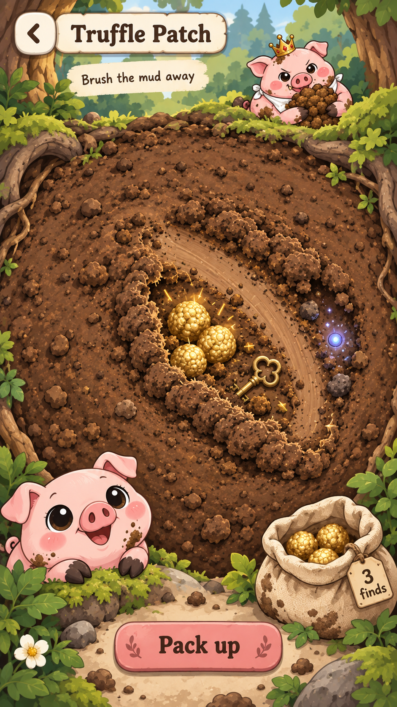
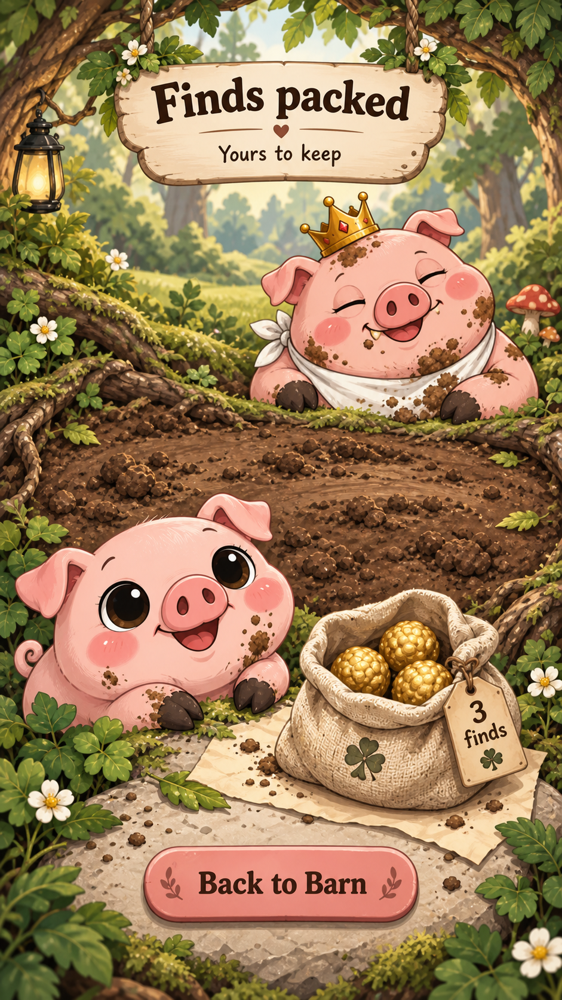

# Living Mud Patch — selected digging direction

Brian selected **Living Mud Patch — tactile brushing** on 2026-09-12 after
comparing it with an underground cutaway and a sniffing-trail concept.
The native implementation is now staged with generated production layers, brush interaction, logical saves, and durable receipt recovery. Final native acceptance and production rollout are pending; these mockups remain the visual authority.

- **Job:** spend a warm spare minute brushing away mud, uncover a surprise,
  and bring the earned finds back to the Barn. Serves Collect and Contend.
- **Active composition:** one large organic mud patch, a small Hungerer at its
  far edge, Rosie watching from below, and a pouch that counts uncovered finds. Only the confirmed receipt calls them packed.
  The surface feels continuous; the existing seeded board and reward validation
  remain authoritative underneath the native Skia renderer.
- **Interaction:** brushing displaces soft crumbs and gradually exposes the
  existing objects. Preserve rub/shove, the existing stir budget, and keeping
  fully uncovered finds. The concept does not authorize new depth, currency,
  rewards, or changes to board generation.
- **Finish:** stop accepting brushing while submission settles. Only confirmed
  rewards enter the receipt. Show “Finds packed” and “Back to Barn”; after
  dismissal, hide the completed Feeding's dig entry until the next window.
  Failed or uncertain submission keeps a recovery path, never a false success.
- **Craft:** cream paper, warm ink outlines, soft earth, rose controls, real
  Rosie/Hungerer character assets, minimal copy, no decorative slogans or
  promotional signs. Keep at least 44pt touch targets and Reduce Motion support.

## Selected mockups

Illustrative amounts in these mockups are not live account balances.

Generated with the built-in `image_gen` tool. Exact prompts and source paths:
[selected-prompts.json](../../assets/concepts/digging/2026-09-12/selected-prompts.json).
The original three directions and their prompts remain beside these images.

## Implementation and acceptance

The staged implementation is tracked in [the production plan](2026-09-12-living-mud-patch-production-plan.md) and [the execution handoff](../handoffs/2026-09-12-living-mud-release.md). Production art under `assets/images/patch/living-mud/` has separate forest, mud, and transparent pouch layers, with saved and embedded imagegen prompts. Text, reward counts, controls, and the accessible patch targets remain native.

Native code uses the existing board/reward rules. Account/window-bound submissions, stored receipts, logical progress saves, and completed-entry hiding have automated coverage. A paid shove that cannot fit the remaining stir budget leaves the board unchanged and asks for a gentle rub, preventing server action-cap rejection.

Final small/large native captures, tactile interaction/performance, accessibility acceptance, the finish review, and design documentation remain pending. The first large-phone inspection showed the primary action below the first viewport; the responsive correction is implemented but still needs the final native check. Concurrent Simulator activity has interrupted that verification.

Build 181 contains timezone compatibility and completed-entry hiding, not this redesign. The durable receipt migration is staged for Brian's separate production go; an isolated dry-run selects only that migration. No Living Mud binary or public release is recorded yet.
