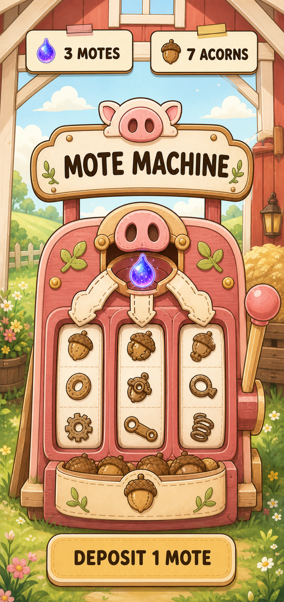
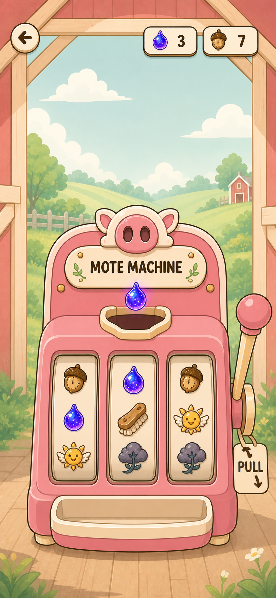

# Mote Machine — Rosie Style Lock

Date: 2026-08-30

Before choosing a Mote Machine layout, the concepts need to match the visual language already shipping around Rosie.

## Authoritative references

1. `assets/images/homepage-bg.jpg` — shipped Barn environment: bright painterly countryside, airy sky, fresh greens, textured fields, simplified natural shapes.
2. `assets/images/sprites/rosie/idle_1.png` — shipped character rendering: confident warm-brown outline, smooth rounded cartoon geometry, soft cel-painted highlights, friendly readable forms.
3. `components/Barn.tsx` and `constants/theme.ts` — shipped interface language: cream taped tickets, dark ink, rose/sun accents, Caprasimo/Nunito type roles, hard offset sticker shadows, compact supporting UI.

Older Mote concept art is authoritative for interaction ideas only, not rendering style.

## Calibration probe



Asset: `assets/concepts/mote-machine/2026-08-30-rosie-style-lock/barn-stage-style-calibration-v1.png`

This successfully moves the concept toward the app by replacing the dark paper theater with a bright open Barn, using Rosie's line weight and rounded painted forms, and adopting the Barn's taped balance tickets.

It is not the final style lock. The next pass must remove the remaining generated stitch marks, generic gear/spring reel symbols, surplus wood detailing, and decorative leaves. The reels should use a small project-authored symbol family derived from Motes, Clockwork Acorns, Auto-Tickler parts, blessings, and curses.

## Generation prompt

Mode: built-in GPT image generation, style-transfer workflow.

```text
Use case: style-transfer
Asset type: high-fidelity portrait iPhone game UI calibration mockup for Tickle the Pig
Input images:
- Image 1: composition target only. Preserve its Barn Stage information hierarchy and central Mote Machine interaction.
- Image 2: AUTHORITATIVE shipped app environment style. Match its bright painterly countryside, airy daylight, textured gouache-like fields, simplified natural shapes, and green/sky palette.
- Image 3: AUTHORITATIVE shipped Rosie character style. Draw the machine as if the same illustrator drew Rosie: clean confident dark-brown outlines, smooth rounded cartoon geometry, soft cel-painted highlights, pink/cream warmth, large friendly readable forms. Rosie is a style reference only; do not place Rosie in the scene.
- Image 4: supporting UI-language reference only for cream taped tickets, simple bold labels, friendly barn objects, and mobile hierarchy. Do not copy its navigation or farm layout.

Primary request: Restyle the Barn Stage Mote Machine so it genuinely belongs inside the currently shipped Rosie/Barn app. Keep a single large machine centered on the page, but replace the dark layered paper-diorama, stitched fabric, scalloped curtains, night scene, dense wood grain, and miniature theater with a bright daytime open-barn/meadow presentation derived from Images 2 and 3. The machine is a friendly painted wooden contraption with rounded silhouette, Rosie-like facial warmth through a simple pig-snout emblem, three clear vertical reel windows, a glowing blue-lilac Mote deposit cradle, one large low right-side lever, three visibly causal brake tabs, and an attached Clockwork Acorn storage pocket. Use the app's actual visual vocabulary: pale sky, fresh greens, barn red, rosy pink, sunny yellow, cream paper tickets, dark warm outlines, restrained hard offset shadow only on UI tickets. Keep environmental detail light enough that the machine remains dominant.

Composition: edge-to-edge portrait mobile screen; safe top area; compact cream taped balance tickets at top; machine occupies the central 60–65%; large thumb-reachable action at bottom; no custom tab bar.
Text (verbatim, exact, no other words): "MOTE MACHINE", "3 MOTES", "7 ACORNS", "DEPOSIT 1 MOTE".
Typography: friendly rounded display lettering consistent with the app; dark warm ink; avoid narrow condensed carnival type.
Constraints: preserve the Mote-to-machine-to-acorn physical story; always-positive cozy helper energy; Rive-authorable separated forms; 44-point-looking controls; no Rosie character; no casino framing.
Avoid: photorealism, 3D render, sewn fabric, stitch marks, cut-paper collage, scrapbook tape clutter, theater curtains, night lighting, steampunk gears, brass density, casino symbols, payout language, coins, odds, jackpot, neon, chrome, glass UI, generic card grid, tiny labels, emoji, old alchemy content, extra text, watermark.
```

## Proposed lock

- **Environment:** the shipped Barn's luminous painterly daylight.
- **Object rendering:** Rosie's smooth outlined cartoon painting, not cut-paper collage.
- **UI chrome:** existing taped tickets and warm ink tokens; no new ornamental frame language.
- **Machine personality:** rounded and friendly, expressed through silhouette and motion—not a literal character face everywhere.
- **Material limit:** painted wood, cream enamel/paper, and a small amount of metal only where the mechanism requires it.
- **Detail limit:** every visible piece must animate, explain the resource path, or support the control hierarchy.

## Impeccable V3 hierarchy lock



Asset:
`assets/concepts/mote-machine/2026-08-30-rosie-style-lock/mote-machine-impeccable-v3-ready.png`

This is the selected Rive hierarchy target. An Impeccable critique rejected the
prior composition because it showed a Mote beam and implied payoff in READY,
and because its glossy rendering still read as a separate casino-like game.
V3 establishes the correct state truth: a separate Mote waits above an empty
feed well, the reels are still, the physical lever is the only primary action,
and the reward tray is empty. The Barn is now quiet support rather than a second
spectacle.

The hierarchy is locked, not every generated pixel. Rive production must keep
the Mote, feed aperture, three reel strips/masks, reward cavity, reward icon,
and lever pieces independent. The final paint pass should simplify toward broad
Rosie pink/cream fills, dark ink contours, and restrained highlights; use glow
only during deposit and reveal. Dynamic balances and the reward receipt remain
native.

The importable V3 layer package and exact state contract live in
`assets/concepts/mote-machine/2026-08-30-rosie-style-lock/rive-parts-v3/README.md`.
