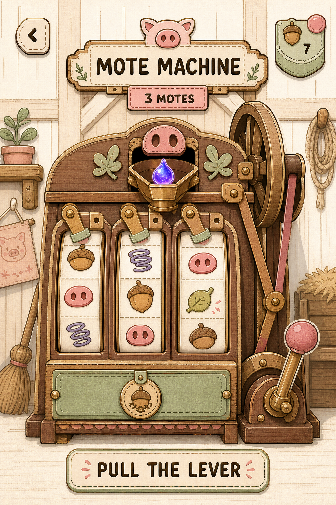
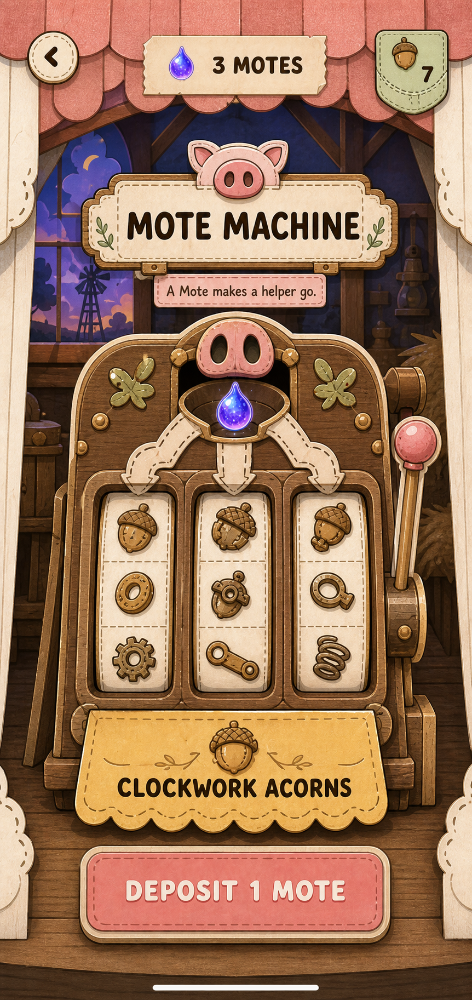
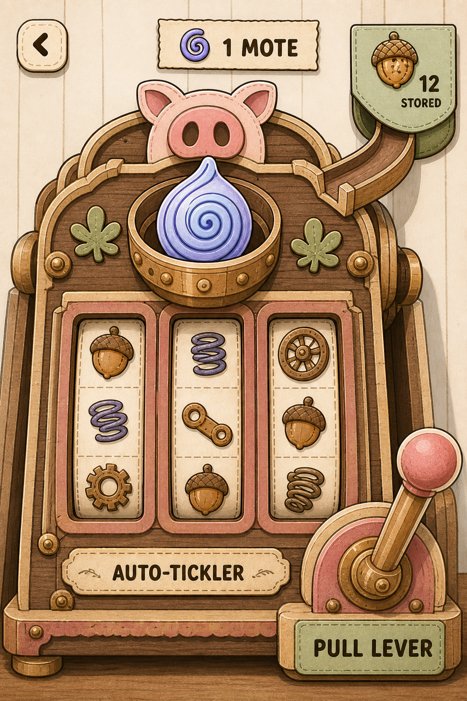

# Mote Machine — Three Visual Directions

Date: 2026-08-30

These are high-fidelity visual direction probes for the native iOS Mote Machine. They compare three different interaction silhouettes in the same **ready-to-spin** state. They are not final layouts, Rive files, or accessibility specifications.

## Locked product requirements

- A deposited Mote always produces something useful.
- The machine converts a Mote into Clockwork Acorns, the Auto-Tickler's own charging resource.
- The result is not money, a wager, odds, a near miss, or a purchasable play.
- Rive owns the physical performance: deposit, wake-up, lever pull, three vertical reels, staggered braking, reveal, and settle.
- The app owns truth and inventory; the server confirms the result before the performance begins.
- The art language is Tickle the Pig's warm paper craft: ink outlines, hard offset shadows, tactile materials, Caprasimo/Nunito typography, and no emoji.
- The machine is the page. Navigation, balance, and status remain supporting information.
- Controls must remain usable one-handed, respect iOS safe areas, meet 44-point touch targets, and have a reduced-motion path.

## Direction 1 — The Barn Bench

**Thesis:** Make the conversion legible by exposing the workshop mechanism. The player's eye can follow the Mote from hopper to flywheel to reels to separate brake shoes and finally to the result drawer.

**Best quality:** Tactile cause and effect. This direction gives Rive the clearest physical choreography and makes staggered reel stopping feel native to the object.

**Risk:** It can drift into generic steampunk if gears and workshop props multiply. The next pass should remove non-functional clutter and explicitly label the result drawer `CLOCKWORK ACORNS`.

Asset: `assets/concepts/mote-machine/2026-08-30-three-directions/01-barn-bench.png`

## Direction 2 — The Barn Stage

**Thesis:** Treat every spin as a tiny storybook performance. A layered paper proscenium frames a sleepy machine that wakes, becomes delighted, performs, and presents its acorns.

**Best quality:** Strongest branded full-screen experience. It feels like a place in Tickle the Pig rather than a slot-machine skin, while preserving a large readable lever and visible Mote-to-machine light path.

**Risk:** The stage and reel symbols can become too decorative. The next pass should simplify the reel glyphs and ensure the machine remains the actor, not the scenery.

Asset: `assets/concepts/mote-machine/2026-08-30-three-directions/02-barn-stage.png`

## Direction 3 — The Pocket Ritual

**Thesis:** Compress the whole loop into a one-handed ritual. The Mote is the hero, the reels are subordinate evidence of transformation, and the acorn inventory pocket is physically attached to the machine.

**Best quality:** Clearest system comprehension and thumb ergonomics. The low lever and persistent `12 STORED` pocket make the relationship between spin rewards and Auto-Tickler charge immediately understandable.

**Risk:** It has the least spectacle and could resemble a generic crafting screen. The Mote-count marker also needs the real Mote droplet icon rather than the generated spiral glyph.

Asset: `assets/concepts/mote-machine/2026-08-30-three-directions/03-pocket-ritual.png`

## Adversarial comparison

The Barn Bench has the best animation grammar. Its parts tell Rive exactly what should move and why, but it needs aggressive restraint to avoid a gear-filled contraption cliché.

The Barn Stage has the most personality and the strongest reason to occupy a full page. It turns the spin into a memorable performance without relying on casino language. It is the best foundation if the Mote Machine should become a recognizable game landmark.

The Pocket Ritual explains the economy best. It makes the output feel owned and useful, not like an abstract prize. Its inventory pocket and low lever should survive even if another visual direction wins.

## Recommendation

Advance **Direction 2, The Barn Stage**, then borrow two ideas:

1. Bring in the Barn Bench's visible braking causality so each reel stop has a physical source.
2. Bring in the Pocket Ritual's attached acorn inventory pocket and low, thumb-friendly lever.

The resulting direction should be a storybook stage with a mechanically believable performance and an unmistakable Mote-to-Acorn economy.

## Shared-primitives decision

shadcn/ui is not used directly because this screen is React Native plus Rive, not a web interface. Its useful discipline still applies: reuse project tokens and shared primitives, keep behavior outside the art file, and avoid one-off floating UI components. The native equivalents should come from the existing Tickle the Pig component system.

## Final image-generation prompt set

Mode for all three probes: built-in GPT image generation, portrait mobile game UI concept, image references supplied from the current Mote Machine and established Tickle the Pig paper-craft concepts.

### Barn Bench prompt

Create a high-fidelity portrait iPhone game-screen mockup for Tickle the Pig called **The Barn Bench**. Show a single collectible workshop machine as the page: cream handmade-paper barn wall, bark-brown cabinet, inked 2 px outlines, hard 4 px offset shadows, warm rose/sage/sun/lilac/sky accents, Caprasimo-like display lettering, Nunito-like labels, no emoji. Ready-to-spin state. A glowing blue-lilac Mote sits in a physical hopper; a visible path leads to a flywheel, three tall vertical reels, three individual mechanical brake shoes, and a closed sage result drawer labeled CLOCKWORK ACORNS. Header plaque: MOTE MACHINE. Quiet inventory: 3 MOTES and an acorn pocket with 7. Large reachable control: PULL THE LEVER. Make every moving part physically causal and Rive-authorable. Avoid casino language, coins, payouts, odds, neon, chrome, generic card UI, steampunk clutter, floating particles, or old alchemy content. The result should feel like a beloved handmade barn toy, not a slot machine.

### Barn Stage prompt

Create a high-fidelity portrait iPhone game-screen mockup for Tickle the Pig called **The Barn Stage**. Build a layered paper-theater proscenium at blue hour with roof valance, side flats, and a small barn window. Center one charming Mote Machine as the actor: sleepy while idle, visually ready to wake and become delighted. Use cream paper, bark ink, hard zero-blur offset shadows, rose/sage/sun/lilac/sky accents, Caprasimo-like title lettering, Nunito-like labels, no emoji. Ready-to-spin state: 3 MOTES, MOTE MACHINE, a glowing Mote in a deposit cradle, subtle physical light channels into three vertical reels, a large reachable right-side lever, and an attached result apron labeled CLOCKWORK ACORNS. Supporting copy: A Mote makes a helper go. Primary action: DEPOSIT 1 MOTE. Make the scene Rive-authorable as deposit, wake, anticipation, spin, staggered braking, reveal, and settle. Avoid casino framing, coins, jackpots, odds, near misses, chrome, neon, floating cards, and old alchemy content.

### Pocket Ritual prompt

Create a high-fidelity portrait iPhone game-screen mockup for Tickle the Pig called **The Pocket Ritual**. Use a close crop of a compact bark-and-paper machine designed for one-handed play. The glowing blue-lilac Mote is the visual hero. A physical chute connects the machine to a top-right Clockwork Acorn inventory pocket reading 12 STORED; the pocket is visibly part of the object, not a floating HUD card. Include 1 MOTE with the real droplet-style Mote icon, three narrow subordinate vertical reels, an AUTO-TICKLER maker plate, and a low thumb-reachable lever labeled PULL LEVER. Use cream handmade paper, ink outlines, hard offset shadows, rose/sage/sun/lilac/sky accents, Caprasimo-like display lettering, Nunito-like labels, no emoji. Communicate possession and useful transformation more strongly than random spectacle. Keep it Rive-authorable and uncluttered. Avoid casino language, coins, payouts, odds, neon, chrome, decorative tape/stars/particles, generic crafting UI, and old alchemy content.

## Next pass

After a direction is selected, produce one refined visual pass, one ready/spinning/result state strip, and a Rive artboard/state-machine specification. Do not implement the live screen until that refined direction is approved.
