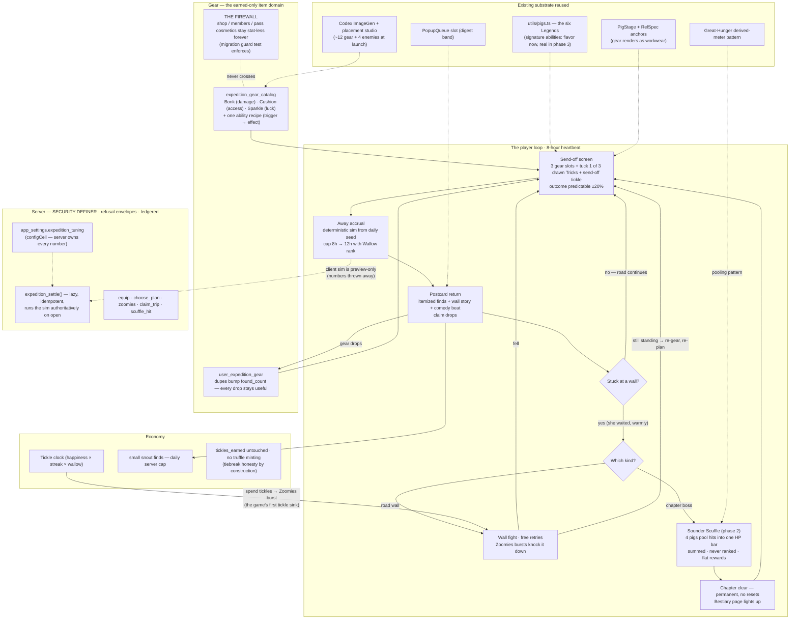

# Rosie's Ramble — the idle battler, end to end

*Plan drafted 2026-07-28. Technical name in code: **expedition** (`utils/expedition.ts`, `expedition_*` RPCs, `app/expedition.tsx`). Player-facing name: **Rosie's Ramble** (working title — the prototype's name, kept until the founder renames it). Player-facing words stay on screens; code stays technical.*

---

## 0. What this is, in one sentence

**Send your pig rambling down the road while you're away; dress her in gear that decides how she fights, and come home to the story of what happened.**

Secondary sentence (the social layer): **when a wall stops every pig on the road, your Sounder knocks it down together.**

If a feature in this plan can't hang off one of those two sentences, it gets cut.

## 1. Why now, and what already exists

- `app/idle-battler-prototype.tsx` ("Rosie's Ramble", dev-only, 3 UI variants) already answers the fantasy question: Rosie progresses while away; Tickles charge **Zoomies** bursts; **gear changes how a wall is overcome**; *"affection helps; absence never hurts."* This plan grows that throwaway into the real mode.
- The pig cast exists: `utils/pigs.ts` catalogs **Rosie, Copper, Pepper, Bandit, Pickles, Biscuit** — the same six Legends as Rosie's Loadout, each already carrying a coat/accent/motif and a full sprite pack (idle/happy/sad/jump/walk/wave/tired/surprise + lounge walk strips).
- The rendering substrate exists: `PigStage` composites pig + worn items via RelSpec anchors; `AnimatedCosmetic` does procedural FX from data recipes — the exact pattern the ability framework reuses.
- The server patterns exist: SECURITY DEFINER RPCs with `{ok:false, reason}` envelopes, `configCell` server-owned tuning, the Great-Hunger **derived-meter** pattern for pooled co-op damage, the Dig-Off's lazy/cron resolution, `daily_shop()` date-seeding for deterministic boards, and the active-effects timed buff system.
- The one genuinely missing layer: **items with stats**. Cosmetics today are stat-less by design — and must stay that way (see §4.1).

## 2. Charter check (run before anything else)

| Lens question | Answer |
|---|---|
| Which pillar? | **Collect** (gear, bestiary, pig roster) + **Connect** (Sounder wall-breaking, send-off tickles on a friend's pig) + **Contend** (lightly, phase 4: chapter progress as Sounder milestone — never a new ladder). |
| One sentence? | Yes — §0. Each subsystem also holds one: gear ("what she wears decides how she fights"), Zoomies ("tickles charge a burst"), Scuffles ("the herd hits the wall together, hits add up"). |
| Fair by construction? | Server-authoritative settle from a per-user daily seed; deterministic sim with client mirror parity (the `rooting.ts` pattern); all mints ledgered and capped; participation-gated Scuffle rewards. |
| Losing still warm? | There is no losing. A pig who can't pass a wall **waits at it** — away progress is never negative, nothing is ever lost while away ("came home early with a muddy snout", never item loss). Scuffle contributions are summed, never ranked, inside a Sounder. |
| Reward pipeline sustainable? | Launch needs ~12 gear sprites + 3 enemy sprites + 1 boss; enemies/gear ride the existing Codex ImageGen lane (`tools/regen_studio.py`) and the RelSpec placement studio. Chapters ship at art pace, with the road "resting" gracefully between chapters (an announced lull, not a broken promise). |

**Anti-patterns explicitly rejected** (each is a genre staple the research flagged): gacha/pity/fusion pyramids; damage-ranked leaderboards inside the crew; global PvP vs. strangers; sub-hour prestige; energy meters that deny play; offline failure with loss; monthly power-creep releases; subsystem accretion (depth goes *inside* the ramble — new roads, walls, gear — never new system types).

## 3. What the research says (and how we apply it)

Full report lives with this plan's research notes; the 12 load-bearing genre mechanics and our verdicts:

| # | Genre mechanic (source) | Verdict for TTP |
|---|---|---|
| 1 | Auto-resolving combat, player-authored setup (all) | **Adopt.** All decisions live on the send-off screen; the fight is a verdict on preparation, re-attemptable free. |
| 2 | Away-accrual + warm return report (AFK Arena campfire, Melvor ledger) | **Adopt — it's the spine.** Capped accrual creates the return appointment; the report is a postcard, itemized and honest. |
| 3 | Exponential cost curves / stage walls (Cookie Clicker math) | **Adopt gently.** Walls exist, but numbers stay small and honest (boss HP 9, damage 1–4) — a find is a find. |
| 4 | Permanent meta-layer, nothing wasted (resonating crystal, Favor) | **Adopt.** No resets at all (v1). Chapter clears are permanent; gear is permanent. |
| 5 | Roster breadth pressure (factions, restrictions) | **Adapt.** Later chapters favor different pig temperaments — but via *invitations* ("Bandit would love this bramble"), never lockouts. |
| 6 | Tank/DPS/support role ceiling | **Adopt as 3 stats max** — see §4.2. |
| 7 | Long-timer dispatch missions (bounty board) | **This is just the Ramble itself** tuned to the 8-hour feeding heartbeat. No second dispatch system. |
| 8 | Free-retry puzzle fights with shown enemy comps | **Adopt.** Every wall names its behavior before you send ("The goose pecks first"). Outcome predictable from the send-off screen. |
| 9 | Async small-group damage pooling (TT2 clan raids) | **Adopt at N=4 — the Sounder Scuffle.** Sum, never rank, inside the crew. |
| 10 | Recurring earnable event content (Idle Champions monthly champion) | **Adopt in phase 4** — seasonal road festivals with earnable gear that returns yearly. |
| 11 | Build identity via small choice surface (1-of-3 drafts, pick-a-spec) | **Adopt as the Plan choice** (already in prototype variant C) + gear abilities. |
| 12 | Automation/convenience as earned reward (familiars, offline caps) | **Adopt.** Wallow rank raises the away-cap (8h → 12h) — prestige buys a better night's sleep. |

Legibility rule from the research, adopted verbatim as a design law: **a player must be able to predict a wall fight's outcome ±20% from the send-off screen, and when wrong, see why in one glance.**

## 4. Game design

### 4.1 The two item worlds — the earned-over-bought firewall

This is the plan's most important structural decision:

- **Cosmetics stay stat-less forever.** Everything in the shop, members band, pass, and exchange keeps buying *expression only*. No existing item gains a stat. (Money must never buy advantage; members items are bought.)
- **Gear is a new, separate item domain** — `expedition_gear` — and is **earned only**: it drops from the road, from walls, and from Scuffles. It is never sold for snouts, never in the shop, never members-gated. Gear has exactly the stats cosmetics lack.
- Gear still *renders* on the pig during the Ramble via the same RelSpec/PigStage machinery (a saucepan lid is worn like a hat, held like a held item) — but only on the Ramble surfaces. The Barn look stays the player's cosmetic look; gear is workwear, donned for the road.

### 4.2 The stat framework — armor, damage, and one flavor

Per the research's legibility ceiling, gear carries at most three numbers, and most pieces carry one:

| Stat (code) | Player-facing | What it does |
|---|---|---|
| `bonk` | **Bonk** | Damage per swing at a wall. The rate stat. |
| `cushion` | **Cushion** | Armor. Decides **which roads are safe to ramble** — each road segment names a Cushion threshold ("The bramble path wants Cushion 3"). Below it, the pig stops at the segment and waits (no loss, ever). The access stat. |
| `sparkle` | **Sparkle** | Luck/support flavor: find quality, Zoomies charge rate, friend-effects. The personality stat. |

The single most satisfying gear sentence in the genre — *"new boots mean I can now idle the swamp"* — maps directly: **"the Quilted Vest means Rosie can brave the bramble path."** Gear = rate + access, never a spreadsheet.

### 4.3 The ability framework — data, not code

Every gear piece carries **one ability**; every pig identity carries **one signature ability** (their Legend kit, §4.5). Abilities are one-line, behavior-changing, and visible in the postcard ("Her Saucepan Lid blocked the goose's opening peck — you saw it coming").

Abilities are **data recipes interpreted by one sim kernel** — the `cosmeticFx.ts` pattern applied to gameplay. An ability is `{trigger, effect, magnitude, flavor_line}`:

- **Triggers:** `on_wall_start` · `on_swing` · `on_zoomies` · `on_find` · `on_segment_enter` · `on_return` · `on_ally_scuffle_hit` (phase 2)
- **Effects:** `block_hits` · `bonus_bonk` · `extra_find` · `find_quality_up` · `speed_up` · `zoomies_charge_up` · `cushion_up` · `echo_hit` (phase 2)

New gear = a catalog row + a sprite + a RelSpec. **Content, not code.** The kernel validates recipes at load; unknown triggers/effects fail closed (the piece works as a plain stat stick) so old clients never break on new content — the same forward-compatibility posture as the config cells.

Launch ability set: ~12 recipes (one per launch gear piece), e.g.:

| Gear (slot) | Stats | Ability |
|---|---|---|
| Saucepan Lid (head) | Cushion 2 | Blocks the wall's opening hit. |
| Wooden Spoon (held) | Bonk 2 | Zoomies bursts bonk +2 extra. |
| Lucky Clover (charm) | Sparkle 2 | One extra find per trip. |
| Quilted Vest (body) | Cushion 3 | Safe on bramble roads. |
| Tin Colander (head) | Cushion 1, Sparkle 1 | Finds shine brighter (quality up). |
| Rolled Newspaper (held) | Bonk 1 | First swing each fight bonks twice. |
| …6 more at launch… | | |

### 4.4 The loop, hour by hour

1. **Send-off (the decision, ~60 seconds).** Dress the pig in 3 gear slots (head/body/held+charm), **draw 3 Tricks from your deck and tuck 1 in the satchel** (the Archero-style authored choice — see §4.6; the three starter Tricks are press on / nose for shinies / study the wall), give a send-off tickle. The screen shows the road ahead: next segment's Cushion ask, next wall's named behavior, predicted outcome.
2. **Away (0–8h, Wallow-extended to 12h).** The pig walks the road. Deterministic accrual from a per-user daily seed: distance, finds, and — if a wall is reached and the loadout beats it — the wall falls. If it doesn't, she waits at it, warmly. Absence never hurts.
3. **Return (the ceremony).** A **postcard** report: itemized finds (Melvor's honest ledger in TTP's voice), the wall story, what the gear did, one comedy beat (Almost a Hero's nap-flavor). Claim drops. Registered as a popup slot in `constants/popupPriorities.ts` (digest band, 40–55).
4. **The wall (the fight, when she's stuck).** Open the scuffle view (prototype variant B): the wall's HP bar, your pig squared up. **Zoomies:** spend tickles to charge a burst — a real tickle *sink* (today tickles only convert to snouts), and the bridge between the core tickle loop and the battler. Swings resolve deterministically; retries are free; the fix for a lost fight is gear/plan, never money.
5. **The Sounder Scuffle (phase 2).** Chapter bosses are too big for one pig: the crew's hits pool into one shared HP bar (the Great-Hunger derived-meter pattern, scoped to a Sounder), each pig contributing on its own schedule within the beat. Rewards flat per participating pig (≥1 hit) — summed, never ranked. "We're two hits from the troll going down" is a text message: this is the Connect payload.

### 4.5 All the different pigs

- **v1:** the player's active pig rambles (Rosie or their Pen companion — `usePigRoster` already resolves who). Every pig identity carries a **signature ability** aligned with its Rosie's-Loadout Legend kit and `pigs.ts` motif — Copper stubborn (Cushion+), Bandit sneaky (finds+), Pickles chaotic (Zoomies+), Pepper bold (Bonk+), Biscuit cozy (away-cap+), Rosie balanced (all rounder).
- **Roster note (decided — see §10.2):** companions are currently Slop-Club-gated. Signature abilities are *advantage*, so either (a) v1 signature abilities are flavor-only (different postcard voice, zero stats) until pigs become earnable, or (b) the Ramble becomes an earn-lane for companions (chapter clears recruit pigs into the *expedition* party without touching the Home/Pen membership perk). **Recommendation: (a) at launch, (b) in phase 3** — phase 3's "trail friends" are earned party members who join the ramble party, while the Pen stays the membership's Home-companion perk. Membership never buys battler power.
- **Phase 3:** party formation-lite — two pigs walk together; **adjacency abilities** ("braver next to a friend") give the Idle Champions formation puzzle at N=2, not a grid.

### 4.6 The card layer — Rosie's Loadout comes to the road

Cards enter the battler **by replacing a surface, never by adding one.** The send-off's abstract Plan (1-of-3) was already a draft; it becomes a *card* draft. Decision count at send-off stays exactly the same — the choice just gains a collection behind it, art on its face, and the physical game's vocabulary.

**One sentence:** *Rosie brings one card on every trip — play it when it matters.*

The card game's four classes map one-to-one onto systems this plan already has:

| Rosie's Loadout class | In the battler | Replaces / extends |
|---|---|---|
| **Legend** | The pig you send. Pig identity card = its signature ability (§4.5). | The roster, unchanged. |
| **Trick** (deck card) | The send-off draft: draw 3 from your collected deck, tuck 1 in the satchel. Tucked = its passive shapes the trip (the old Plan). In a wall fight it can instead be **played** — the fight's one authored tap, alongside Zoomies. | **Replaces the Plan entirely.** The three launch Plans (press on / nose for shinies / study the wall) become the three starter Tricks every player owns. |
| **Critter** | A small friend card that rides along — passive trip effects (a firefly that spots finds at night, a frog that croaks before an ambush). One critter slot on the satchel. | Phase 3, with formation-lite — a critter is the "adjacent friend" for solo pigs. |
| **Enemy** | **The Bestiary pages ARE Enemy cards.** First defeat of a wall earns its card — silhouette to full art, found-counts on repeats. | Unifies §4.6's Bestiary with the card game; one collection shelf, not two. |

**Training — the dupe answer.** The physical game's Training rule ports verbatim and solves the genre's dupe problem in one move: any duplicate card can be **tucked under a pig** as Training — a permanent, small, capped bump (+1 Bonk *or* Cushion *or* Sparkle per tuck, ~5 tucks per pig per chapter arc, server-tuned). Every card that drops stays useful forever (the one great Idle Heroes idea, without the pyramid), and the tuck ceremony mirrors the tabletop exactly — a card slid beneath the Legend.

**Implementation cost: near zero new machinery.** A card *is* an ability recipe (§4.3) wearing card art — same `{trigger, effect, magnitude, flavor_line}` kernel, same fail-closed validation. New surface area is only: `expedition_card_catalog` + `user_expedition_cards` (count column) + `expedition_training` (tucks ledger) tables, `draw_trip_hand()` (date-seeded, the daily_shop idiom), `pick_trip_card`, `play_card`, `tuck_training` RPCs, and a card frame component. Drops ride the existing settle/claim path.

**Earned-over-bought check.** Cards drop from the road, walls, Scuffles, and chapter clears — never sold, never members-gated, same firewall and guard test as gear. **The physical crossover** (a Golden-Ticket QR in a printed Loadout pack granting something in-app via the existing `redeem_code` infra) is charter-safe **only as expression**: alt-art / foil frames for cards you earn in play — a printed pack must never grant a card's *power* before the road does. That line goes in the guard test, not just this paragraph.

### 4.7 The Bestiary

Every wall/enemy first defeated lights a page in the **Bestiary** — a third shelf beside the Burrow Book and Field Guide on `dig-collection` (silhouette until met, ceremony reveal, found-counts). Enemies are TTP-flavored: mischievous, hungry, or lonely — never evil (the Rosie's Loadout enemy rule). Launch: Tollbooth Goose (chapter 1 boss) + 3 road enemies.

### 4.8 Economy rules

- **Faucets:** gear (new domain, no currency), small snout finds (capped per day, server-tuned), Bestiary/chapter achievements paying existing earn-only rewards (titles, XP).
- **Sinks:** Zoomies (tickles — the headline sink), gear polish (snouts, phase 3: small deterministic +1s with no failure chance).
- **Never:** tickle minting (`tickles_earned` tiebreak stays honest), golden truffle minting (that's the dig loop's mint), any gear purchase lane.
- All numbers server-owned via `app_settings.expedition_tuning` config cell with compiled fallback (the server-config-over-constants law).

## 5. Systems design

### 5.1 Data model (new tables)

```
expedition_gear_catalog     -- server catalog: id, name, slot(head|body|held|charm),
                            --   bonk, cushion, sparkle, ability jsonb, rarity,
                            --   drop_table_key, display_order, art keys
user_expedition_gear        -- ownership ledger: user_id, gear_id, acquired_at, source
                            --   (PK user_id+gear_id; dupes bump a found_count — every
                            --    drop stays useful, the Idle Heroes lesson w/o pyramid)
expedition_state            -- per user: chapter, segment, wall_hp, loadout jsonb,
                            --   plan, seed_date, settled_at, away_cap_h, day_snouts
expedition_trips            -- append-only settle ledger (audit + postcard replay)
expedition_scuffles         -- phase 2: per crew per boss: boss_id, hp_pool, opened_at
expedition_scuffle_hits     -- phase 2: contribution ledger (crew, user, hits, at)
expedition_bestiary         -- user_id, enemy_id, first_met_at, defeat_count
                            --   (an unlocked row IS the Enemy card — one shelf)
expedition_card_catalog     -- Tricks + Critters: id, class(trick|critter), ability
                            --   jsonb (same recipe schema as gear), rarity, art keys
user_expedition_cards       -- user_id, card_id, count (dupes accumulate as
                            --   Training fuel), acquired_at, source
expedition_training         -- tuck ledger: user_id, pig_id, card_id, stat(+1 bonk|
                            --   cushion|sparkle), tucked_at; server-capped per pig
```

### 5.2 RPCs (all SECURITY DEFINER, `SET search_path`, REVOKE/GRANT hygiene, `{ok:false, reason}` envelopes)

| RPC | Does |
|---|---|
| `expedition_state()` | Read: state + catalog slice + tuning + scuffle summary. Lazy-settles first (below). |
| `expedition_settle()` | The heart. Computes elapsed since `settled_at`, clamps to away-cap, advances the deterministic sim from the daily seed (`daily_shop()` date-seed idiom + user id), writes finds/distance/wall damage, appends `expedition_trips`, mints capped snout finds. **Idempotent; called lazily on open** — no cron needed for v1 (the Oracle/drives lazy-resolve pattern). |
| `expedition_equip(p_gear, p_slot)` | Ownership-checked loadout write. |
| `draw_trip_hand()` / `pick_trip_card(p_card)` | Date-seeded 3-card draw from the owned deck (`daily_shop()` idiom — same hand on re-open, no reroll fishing); tuck write. Replaces the old plan RPC. |
| `play_card()` | Plays the tucked Trick in a wall fight (once per fight; returns the blow-by-blow). |
| `tuck_training(p_card, p_pig, p_stat)` | Consumes one dupe count → permanent capped +1; idempotent ledger insert. |
| `expedition_zoomies(p_tickles)` | Debits spendable tickles atomically (bury_truffle debit idiom), converts to burst swings at the current wall, returns the blow-by-blow for the client to animate. |
| `expedition_claim_trip(p_trip)` | Idempotent drop claim (ON CONFLICT DO NOTHING ledger). |
| `scuffle_hit()` (ph. 2) | One pooled hit per pig per window; flat participation rewards on kill via the hunger-stage-rewards grant pattern (stage-scoped, participation-gated, idempotent). |

### 5.3 Determinism & anti-cheat

The sim is a pure function `(seed, loadout, plan, elapsed, tuning) → outcome`. Server runs it authoritatively in SQL/plpgsql at settle; the client runs a TypeScript mirror (`utils/expedition.ts`) for preview and animation only — numbers it produces are thrown away (the Mud Putt rule). Parity pinned by tests that run both against shared fixtures (the `rooting.ts` ↔ `submit_rooting` precedent).

### 5.4 Client architecture

```
utils/expedition.ts        -- pure sim kernel + ability-recipe interpreter + types
utils/expeditionConfig.ts  -- configCell declaration (expedition_tuning)
hooks/useExpedition.ts     -- state fetch, focus refresh, settle-on-open, actions
                           --   (the useSeason/useCrew shape: structured results only)
app/expedition.tsx         -- stack screen: journal home (send-off, road map, postcard)
components/expedition/     -- ScuffleView (wall fight), PostcardReport, GearRack,
                           --   RoadMap, BestiaryShelf (mounted in dig-collection)
```

- **UI verdicts from the v0 playable slice + Impeccable critique (2026-07-28, 22/40 first run; P0–P2 fixed same day):** the postcard and bestiary **earn their place** as designed; journal/send-off/fight needed rework, now applied — one primary CTA at a time, stat pips + docked prediction beside the choices it grades, satchel summary, send-off tickle made mechanically real (zoomies carry into the first wall), Zoomies renders as sprite energy + drawn sparks (never a number — charter feelings rule), ceremony pass on postcard (Tape, spring-in, staggered finds) and fight (animated HP, recoil, per-tickle reaction), all reduced-motion-gated. Round 2 (re-critique 27/40, trend 22→27) fixed the journal CTA's silent no-ops (kernel-refused wasted spends, locked "asleep" states, no off-screen bursts), made the flinch advice keepable (mid-fight block re-check + redundant-play refusal), added mock tickle regen (+1/10min, cap 20), gave boss/chapter clears the postcard's ceremony (shared `Ceremony.tsx`), promoted the shadow type scale into real `TYPE.cardTitleSm`/`TYPE.kickerPillSm` roles, and put the prediction on a tilted Sticker. **Tuck lifecycle decided:** the tucked Trick survives arrival at a wall (playable in the fight it walked into) and comes home to the deck only when a trip completes on the open road — the daily draw-three-tuck-one is a real ritual, and morning-tucked block cards keep their promise. Remaining P3 governance backlog (RARITY_STRIPE adoption, kicker diet, a11y props on overlays/sprites) lives in `.impeccable/critique/`. These verdicts are contract for the real build.
- Entry: a Barn card (like the Truffle Patch chip) + deep link. No new tab.
- The **journal** (prototype variant C) is the home surface; **return ceremony** (variant A) becomes the postcard popup; **live scuffle** (variant B) becomes the wall-fight view. All three prototype variants survive as *rooms of one house*, which is what the prototype was built to learn.
- Rendering: `PigStage` with a `context="expedition"` gear overlay layer; walk animation reuses lounge strips on the road map.
- All UI in tokens (`WHIMSY`/`TYPE`/`RADII`/`SPACE`, Sticker/Glyph/Button); **no emoji** — the prototype's 🥘🪿☘️ placeholders all become ImageGen sprites before any non-dev build.
- Feature-flagged end to end via `app_config` (`expedition` flag) — dark-launchable, and the RPC layer's missing-function tolerance means the client can ship ahead of the migration push.

### 5.5 Art pipeline (the sustainability gate)

| Asset | Count at launch | Lane |
|---|---|---|
| Gear sprites | ~12 | Codex ImageGen (`regen_studio`) → placement studio RelSpecs; flat-sticker law applies (front silhouette only). |
| Enemies + boss | 4 | ImageGen, Rosie-as-reference for scale/style; bestiary silhouettes derived. |
| Road/backdrop | 1 chapter | Reuse Barn background system + one new road backdrop. |
| Postcard frame | 1 | One-off. |

Chapter 2+ ships only when its art batch is done — the road "rests" between chapters with an in-fiction notice.

### 5.6 Testing

- `__tests__/expedition.test.ts` — sim kernel: determinism, away-cap clamp, wall math, every ability recipe, plan effects. Every founder-reported incident becomes a replay fixture (the `digSession.test.ts` discipline).
- `__tests__/expeditionParity.test.ts` — TS kernel ↔ SQL settle parity on shared fixtures.
- `__tests__/expeditionMigration.test.ts` — SQL-as-text guards: grant hygiene, envelope shape, no `tickles_earned` writes anywhere in expedition migrations (tiebreak honesty enforced by test).
- Popup-priority source-scan already enforces the new slot registration.

## 6. Rollout phases

**Phase 0 — Ratify (founder session, ~1 day).** Resolve the Questions below; append the decision to `SKILL.md`'s log (drafted entry at bottom); name the mode.

**Phase 1 — The Solo Road (vertical slice; ~1 week of sessions).** Migration 1 (catalog, state, trips, cards, settle/equip/zoomies/claim/draw/tuck RPCs), sim kernel + parity tests, journal screen + postcard + wall fight, art batch (12 gear + 4 enemies + ~8 Trick cards — the 3 starters plus 5 droppables), Barn entry card, feature flag on for founder build. Training tucks ship here too (they're one table + one RPC, and they make day-one dupes feel good). *Exit gate: the ±20% predictability law holds in playtesting; the postcard reads warm.*

**Phase 2 — The Sounder Scuffle (~3–4 sessions).** Scuffle tables + RPCs, pooled boss bar on the chapter boss, flat participation rewards, crew-facing "the wall is nearly down" moments (in-app first, push later via the notification route table). *This is the Connect payoff; do not ship phase 1 to the public without it — solo idle is the genre's loneliness trap (Melvor/Cats & Soup's one gap).*

**Phase 3 — All the Pigs (~1 week of sessions).** Signature abilities go live as earn-lane trail friends (per §10.2), two-pig formation-lite with adjacency abilities, **Critter cards** (the solo pig's adjacent friend), gear polish sink, Bestiary/Enemy-card shelf ships if it hasn't already.

**Phase 4 — Seasons on the Road (ongoing).** Chapter cadence at art pace; recurring festival gear (yearly-returning, earned); a *light* Contend hook only if the founder wants one — chapter-clear as a Sounder milestone line, never a new ladder beside the Dig-Off.

Ship mechanics: DB pushes wait for explicit founder "go" (house rule); client rides the normal local-build → Transporter train; changelog before build.

## 7. Risks

1. **Second-loop dilution** — the Ramble competes with the Feeding for the same 8-hour attention. Mitigation: the Ramble is the *between-feedings* game (away accrual), the Feeding stays the appointment; the Barn card shows one CTA at a time, never both shouting.
2. **Complexity creep** — the genre's death spiral. The one-sentence test is the merge gate for every phase; depth goes inside (new roads/gear/walls), never sideways (no new system types after phase 3).
3. **Art pipeline debt** — chapters are content-hungry. The "road rests" fallback is designed in from day one.
4. **Stat firewall erosion** — future pressure to sell gear or stat a cosmetic will come. The migration guard test (§5.6) makes the firewall mechanical, not just cultural.

## 8. Drafted SKILL.md decision-log entry (pending founder ratification)

> **2026-XX-XX — The Ramble turns away-time into a story, and gear into the game's first earned power.** Rosie (or your companion) rambles a road while you're away — capped accrual, warm postcard return, walls that wait rather than punish. A new earned-only gear domain (Bonk/Cushion/Sparkle + one data-driven ability per piece) decides how she fights; cosmetics stay stat-less forever, so money still buys expression, never advantage. Chapter bosses fall only to the Sounder's pooled hits — summed, never ranked. Zoomies make tickles a sink for the first time. Serves **Collect** (gear + bestiary are proof you walked the road), **Connect** (the wall is a group text), and legibility (predict the fight from the send-off screen, or see why in one glance).

## 9. System map



Rollout: `P0 ratify → P1 solo road (internal TF) → P2 Sounder Scuffle (public gate) → P3 all pigs + formation-lite → P4 seasonal chapters`.

## 10. Decisions (picked 2026-07-28; founder may veto any of these in phase 0)

1. **"Circle of Pig" does not block.** Nothing by that name exists in the repo, branches, issues, sibling projects, or the games-guide PDF; the plan stands alone. If the design surfaces later (another chat/tool), it gets reconciled in phase 0 as a diff against this doc, not a rewrite.
2. **Companion signature abilities are flavor-only at launch** — distinct postcard voices and animations, zero stats — and become real abilities only with the phase-3 earn-lane (trail friends recruited by chapter clears). Rationale: companions are Slop-Club-gated today, and membership must never buy battler power; flavor keeps the six pigs distinct without touching the firewall.
3. **The name stays "Rosie's Ramble."** It's the prototype's name, it says the fantasy in one word (an away-walk, not a war), and it inherits the game's alliterative voice. Code stays `expedition`.
4. **Zoomies price flat at launch:** one server-tuned number in `expedition_tuning` (starting point: 5 tickles per burst). One price is one sentence; wall-tier scaling stays a v2 lever we pull only if flat bursts trivialize late walls.
5. **Public launch gates on the Sounder Scuffle.** The phase-1 solo slice ships to founder/internal TestFlight only. Solo idle is the genre's documented loneliness trap (Melvor, Cats & Soup), and Connect is this game's differentiator — the mode goes public the day the herd can break a wall together.
