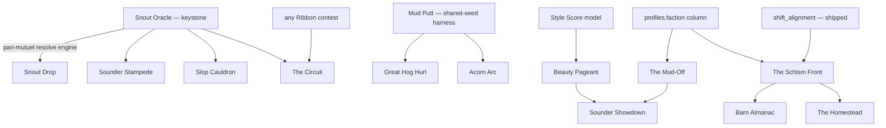

# Tickle the Pig — Design Compendium

Full standalone design specs for the 17 game-mode ideas explored for TTP's next era. Each file follows the same template: **fantasy → player loop → mechanics → schema sketch → economy → anti-abuse → feel → how it composes → MVP → risks.**

These distill four exploration docs (in the parent folder): the broad mode options, the pinned team/pageant/mini-game design, the MiniClip adaptations, and the long-term living-game exploration.

## The two load-bearing insights

1. **The Schism Front is the meta-frame, not just another mode.** TTP's Greedy ◄──► Giver alignment is currently a *private per-player* number — the goblins-vs-angels fiction promises a collective war the mechanics never deliver. Summing those same `shift_alignment` deltas into one public world Tide turns the existing daily loop into months-long stakes, and gives every short mode a reason to exist: Oracle bets, pageant wins, and Mud-Off contributions all become ways to **push the front**. Player behavior *is* the content — the only sustainable long-game shape for a solo dev.

2. **The mini-games collapse into ~4 cheat-proof engines.** Everything async-viable is one of: **server-owns-the-answer pick'em** (Snout Oracle, Pig Pick'em), **shared-daily-seed leaderboard** (Mud Putt, Sounder Stampede, Hog Hurl, Slopword), **co-op pot** (Snout Drop, Slop Cauldron — both reskinned Buried Truffle), or **async-duel** (Acorn Arc). You're not building 17 things from scratch — you're building a few engines and reskinning. Anything that resists those four (live 8-ball, .io arenas, continuous-input driving) is genuinely realtime and correctly deferred.

---

## Core modes

| Idea | What it is | Effort | Depends on |
|---|---|---|---|
| [Snout Oracle](./snout-oracle.md) | Pari-mutuel pick'em — stake snouts on a server-resolved outcome, split the losers' pot. **The keystone.** | M | Shipped primitives only |
| [Pig's Daily Riddle (Slopword)](./pigs-daily-riddle.md) | Wordle on a farm word; server owns the answer; shareable emoji-snout grid. | M | Standalone |
| [The Mud-Off (Teams)](./the-mud-off.md) | Hilltoppers vs Valleyfolk; pick-and-lock; per-capita-with-quorum win; self-funding pit. | L | Ships the `profiles.faction` column |
| [The Beauty Pageant (Style Score)](./the-beauty-pageant.md) | Dress-up scored by a server-side style model + (later) blind voting; dated Ribbons. | M | Style-vector tagging of ~85–90 items |
| [Sounder Showdown (Team Pageant)](./sounder-showdown.md) | Team-vs-team pageant on per-capita Style Score — dodges both voting *and* collusion. | L | Faction column **and** Style Score |

## Mini-games (the ~4 engines, reskinned)

| Idea | Engine | Effort | Depends on |
|---|---|---|---|
| [Snout Drop (Truffle Plinko)](./snout-drop.md) | Co-op pot | M | Standalone (pure Buried Truffle reuse) |
| [Mud Putt (Daily Pin)](./mud-putt.md) | Shared-seed leaderboard | L | Standalone; establishes the seed→submit→re-sim harness |
| [Sounder Stampede](./sounder-stampede.md) | Shared-seed / atomic pool | M | Buried Truffle + trough primitives |
| [The Slop Cauldron](./the-slop-cauldron.md) | Co-op pot | S | `donate_to_drive` (almost verbatim) |
| [The Great Hog Hurl](./the-great-hog-hurl.md) | Shared-seed leaderboard | M | `daily_shop` seed + `grant_tickles` |
| [Acorn Arc (Slingshot Standoff)](./acorn-arc.md) | Async-duel | L | The Mud Putt shared-seed harness + matchmaking |

## Long-term / living-game

| Idea | What it is | Effort | Depends on |
|---|---|---|---|
| [The Schism Front](./the-schism-front.md) | **Flagship.** Public moral world-war on the alignment axis, resolving at Judgement Day. | L (MVP tiny) | `shift_alignment` + `finalize_season` (shipped) |
| [The Barn Almanac](./the-barn-almanac.md) | Weekly serialized mystery on the same gauge — the narrative *skin* on the Front. | L | The Schism Front |
| [Snout Almanac + Hog Line](./snout-almanac-hog-line.md) | Lore-stamped collection Pig-Dex + generational legacy (the warm alignment-reset reframe). | L | `hats`/`user_hats` + `finalize_season` |
| [The Homestead](./the-homestead.md) | Server-authoritative idle farmstead + prestige; Granary tithe pumps alignment. The deepest snout sink. | L | Alignment axis; Front MVP for the Granary pump |
| [The Circuit](./the-circuit.md) | De-fanged county-fair ladder; Ribbon Points from any contest; soft-landing relegation. | L | ≥1 Ribbon-emitting contest (Oracle) |
| [The Wandering Almanac](./the-wandering-almanac.md) | Real-calendar slow-time layer (weather/forage/dispatch/pen-pal). **Harvest the cheap slices**, defer the pilgrimage. | M (slices) | Standalone |

---

## Dependency graph

Read it as: **Snout Oracle** ships the pari-mutuel resolve engine four other modes reuse; **Mud Putt** ships the shared-seed harness Acorn Arc/Hog Hurl inherit; the **Style Score model** gates Pageant→Showdown; the **faction column** gates Mud-Off→Showdown and reskins into the Schism Front's armies; the **Schism Front** stands alone on the existing alignment loop but is most *valuable* once modes exist to feed it.

## Recommended build order

- **Phase 1 — prove the spine.** [Snout Oracle](./snout-oracle.md) (cheat-proof, economically inert, exercises debit→pool→lazy-resolve→idempotent-claim→payout). Then [Slopword](./pigs-daily-riddle.md) (viral daily ritual; pays down the `GREATEST(...)` over-cap display-debt on the first faucet).
- **Phase 1.5 — the cheap living world.** [The Schism Front](./the-schism-front.md) **MVP** (one migration + two lines on `shift_alignment` + one RPC + one Exterior strip). Stands alone today; ship it early so every later mode can feed the Tide.
- **Phase 2 — pay the content tax once.** Style Score model + [solo Beauty Pageant](./the-beauty-pageant.md) (tag ~85–90 items; unlocks four pageant variants).
- **Phase 3 — the team loop.** Faction column + [The Mud-Off](./the-mud-off.md) → [Sounder Showdown](./sounder-showdown.md). Wire the Mud-Off factions to *become* the Schism Front's armies.
- **Phase 4 — cheap reskins & layers.** [Snout Drop](./snout-drop.md), [Slop Cauldron](./the-slop-cauldron.md), [Sounder Stampede](./sounder-stampede.md), [Mud Putt](./mud-putt.md)→[Acorn Arc](./acorn-arc.md), [Hog Hurl](./the-great-hog-hurl.md); the [Barn Almanac](./the-barn-almanac.md) narrative skin; [Wandering Almanac](./the-wandering-almanac.md) slices.
- **Later / optional.** [Snout Almanac + Hog Line](./snout-almanac-hog-line.md), [The Homestead](./the-homestead.md), [The Circuit](./the-circuit.md).

## Cross-cutting footguns (every spec carries these)

- **INLINE the `system_announcements` INSERT** for notifies — never `send_system_announcement()` (admin-gated; silently rolls back the whole payout for non-admins).
- **The first over-cap `grant_tickles` must ship the `GREATEST(...)` display-debt fix** to `home_stats` + `admin_tickle_overview` (flagged in the `settle_tickles` migration header).
- **Snouts move only as a `counter → counter` transfer, never minted.** `grant_tickles` is the sole faucet.
- **Migration filenames must sort after `20260623000000`** (i.e. `≥ 20260624000000`) to avoid a `schema_migrations.version` PK collision.
