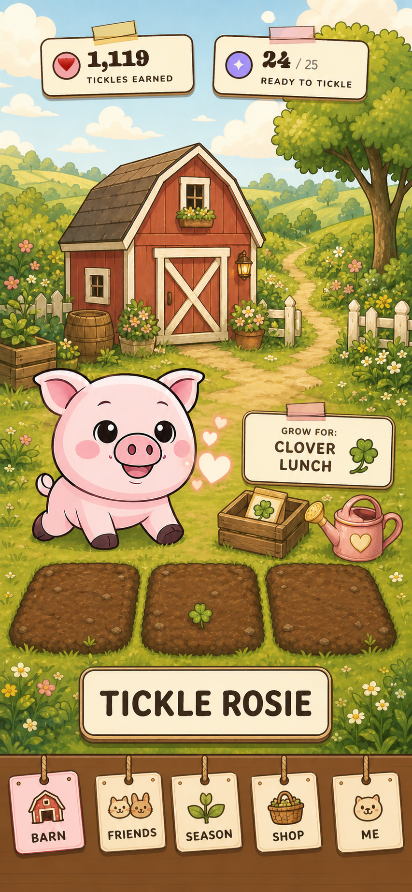
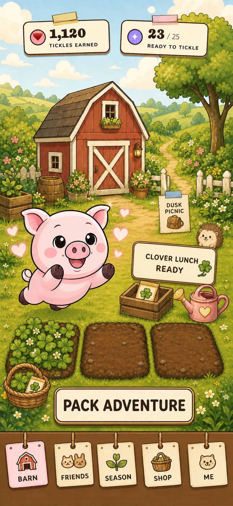
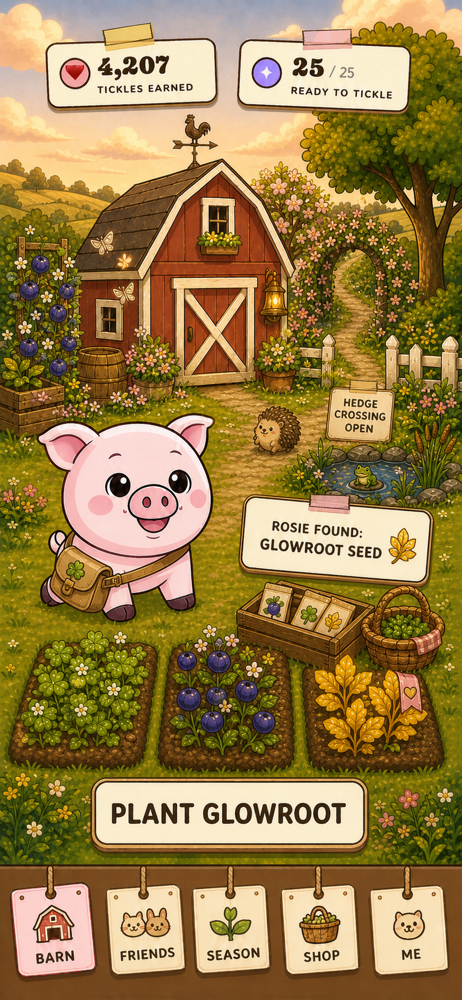

# Tickle the Pig: Homegrown Adventures — build goals

**Status:** Browser gameplay prototype active; eleven-position review loop,
required Clover Seed, optional predictable Compost, real Clover Harvest
Rhythm, persistent Farm stock, one-use Provision preparation, reusable
equipment, causal Adventure vignette, exact return reward and Seed planting,
and a changed Rive Home plus memory-aware Seed tray that survive the next
morning verified locally; authored Rive departure motion now holds Position 8,
lets one leaf backing answer at the crossing, and hands the Farm into dusk
before the Adventure vignette, with rendered desktop, touch, reload,
reduced-motion, and rapid-input validation; Position 4 now derives sparse and
lush growth from React-owned elapsed time and runs one restrained authored
`Clover Growing Sway` cadence without giving Rive timer authority; Position 5
now uses a bed-anchored rhythm cue and gives the authored Rive Harvest a clean,
persisted 560 ms performance before Farm stock appears; Position 6 now turns
the result into a world-anchored four-compartment Farm Stock shelf and full
Clover basket while React preserves exact quantities and causes; Position 7
now centers preparation on a physical open Bag with live visible item choices;
Position 8 now holds the native Rive satchel on Rosie through packing, reload,
reduced motion, departure, and the causal Adventure handoff; Position 9 now
places that handoff in one tangible twilight clearing, with separate complete
Discovery and clue-only Near-Discovery plates beneath live Rive Rosie; the
complete branch now mounts a tightly clipped second Rive view that reveals the
earned Glowroot and gives it one restrained breathing glow, while the clue
branch mounts no reward canvas; Position 10 now brings Rosie into a physical
Barn-worktable homecoming with exact complete and Near-Discovery objects,
one existing authored Rive Return, and reducer-owned stock deltas that survive
fast-forward, reload, reduced motion, and rapid input; explicitly boosted
planting now composes the production Rive asset's native Plant and Growing Sway
clips with one brief bed-level response, while normal planting and all
React-owned resource rules remain unchanged; the first outing is now named **A
Glow Beneath the Hedge** before farming begins, and its duration and clues stay
visible through Bag preparation and departure.

**Implementation record (August 5, 2026):** The deterministic prototype, three
shareable UI variants, approved concepts, anonymous trace, local persistence,
responsive DOM controls, and GitHub Pages route live in
`scripts/prototypes/homegrown-adventures/` and `docs/homegrown-adventures.html`.
The authored Rive scene is checked in: a transparent 390×844 artboard, embedded
Rosie texture, mesh/bone rig, exact View Model contract, and named breathing,
tickle, notice, pack, departure, return, and Bag-hidden motions. The compact
brown clover satchel is a native vector group registered to Rosie's body with
offset-preserving
translation, rotation, and scale constraints. Kitchen Patch bed one now has a
native crop rig with reducer-bound empty, growing, and ready poses plus plant,
flourish, and harvest one-shots.
The same artboard now includes a native Home consequence rig with persisted
hidden/developed poses and a Glowroot flourish for the planted third bed,
flowering hedge crossing, and earned Hedge Bell.
Character-free derivatives of the three approved concepts remain the scene
plates so the Rive rig is the only Rosie rendered. Breathing uses a calm
3.25-second cadence; the first meaningful tickle transitions into a clear
Kitchen Patch notice lean. Packing visibly equips the persisted Bag, return
emphasizes it once, the first Clover Lunch loop changes one bed, and planting
Glowroot reveals a lasting Home change without replacing the whole Barn plate.
Rapid input, deterministic settling, reduced motion, the real rendered route,
and the contract gate pass locally. Rosie's harvest celebration, resident
animation, purpose-sign continuity, and mobile Safari device acceptance remain
Goal 6 work; do not claim the whole motion sheet complete yet. Rosie's return
now borrows the larger story treatment for one brief ceremony only, then
collapses into an optional Home record that leaves Rosie and all three beds
readable. Developed reloads begin compact and reduced motion skips the ceremony.
The post-return illustrated sign is now covered by reducer-driven DOM text:
Glowroot Seed on return, Moonberries as the next named purpose, and a persisted
chosen state. This keeps product text accessible and out of the Rive binary.
Choosing that second intention now fills Kitchen Patch bed two with an authored
purple Moonberry crop. Empty and Growing are persisted Rive poses and Plant is
one bounded arrival; the reducer remains authoritative and no second timer or
economy was introduced.
Moonberries also welcome one persisted dusk moth. Its Present, Arrive, Resting,
and Laugh clips are authored in the same Rive artboard. A fulfilled-state
tickle now restarts the short Laugh response alongside Rosie, settles to the
exact Present pose, and resumes the resident's independent calm cadence without
adding progression state.
One restrained gold paper glint now mirrors that existing Laugh state at phone
scale. Its authored Rive source remains checked in, while a single web
presentation token preserves legibility through parent-artboard rasterization.
It is absent at rest, on reload, and under reduced motion, and rapid tickles
restart one cue rather than creating parallel elements.
The same resident now keeps its calm Home pose on the Barn roofline instead of
hovering in empty sky. Present, Arrive, Resting, and Laugh share that one perch;
the two- and three-pixel body lifts remain intact, and the matching web glint
follows the resident without changing its scale, reward logic, or persistence.
Fulfillment now gives that resident one authored landing instead of an in-place
fade: it appears on the garden-side roof slope, glides up-right, and hands off
to the same persisted perch. Reduced motion paints the complete final authored
frame atomically without exposing an intermediate flight pose.

**Direction checkpoint (August 6, 2026):** The browser experiment now exposes
all eleven approved Homegrown Adventures positions through a prototype-only
Previous / Next rail outside the game surface. Every position is a real,
deterministic reducer preset, carries one player-facing objective and action,
updates the shareable `position` URL parameter, and reloads to the same stable
state. Farm-stock result and Bag selection are now separate positions instead
of one ambiguous packing step. The visual surfaces inside positions 2–10 still
need to be brought up to the `rosie-v3` concept set one bounded checkpoint at a
time; Position 7 is first because its reducer state exists but its typed
Provision / Tool / Pack choices are not yet rendered.

**Preparation checkpoint (August 6, 2026):** Position 7 now renders one calm,
typed Bag surface with Provision, Tool, and Pack slots. Clover Lunch, Hand
Trowel / Lantern, and Wicker Basket / Cloth Wrap are real persisted choices;
every slot may be empty. The chosen loadout remains visible at departure, and
each empty-slot branch returns a specific deterministic Near-Discovery instead
of a generic failure. The current Rive scene still owns Rosie's shared satchel
and packing response while React owns choice state, copy, validation, and the
loadout ribbon. Position 9 is now the highest-leverage gap because those clear
choices lead to a quiet empty Barn rather than the promised causal vignette.

**Bag-response checkpoint (August 7, 2026):** Position 7 now gives every valid
Provision, Tool, Pack, and Empty choice one dedicated Rive-authored `Bag
Receive` performance on the existing native satchel. The open Bag and packed
tokens answer during the same bounded 600 ms window, while React remains
authoritative for exact slot identity, ownership, costs, persistence, and
fast-forward. A rendered product-design pass shortens reward lines, makes each
whole slot card a large Change target, and gives Empty its own 44px action.
Reduced motion skips the one-shot, rapid changes restart it, and direct reload
does not replay it. The next visible weakness is specificity: only the most
recently changed item should lead the shared token response.

**Chosen-item checkpoint (August 7, 2026):** Position 7 now records the latest
React-owned slot transition and uses it only for presentation. During the
existing `Bag Receive` window, the changed card stays legible, one exact item
travels between that card and the open Bag, and only the matching destination
token lands. Emptying a slot reverses its previous item outward. Rapid touch
input replaces the active flight and restarts the one bounded Rive response;
reduced motion paints the new reducer state without a one-shot. The rendered
product-design pass also shortens the empty-card action without weakening its
accessible name. The next visible weakness is Position 8: the correct equipped
state currently paints as a large flat mustard block that obscures Rosie rather
than the believable worn satchel established by `rosie-v3/08-departure.png`.

**Fitted-satchel checkpoint (August 7, 2026):** Position 8 now keeps the same
native `rosie_satchel` but reduces its equipped endpoint to a compact worn pose,
recolors its body and flap from mustard to warm brown leather, and restrains the
Return swing around that same endpoint. The Bag remains attached to canonical
Rosie through Pack, departure, Return, direct reload, and reduced motion; no
duplicate DOM equipment or new inventory state was added. The rendered
390x844, 360x780, and centered desktop views were compared with
`rosie-v3/08-departure.png` through the installed Impeccable design review. The
next visible weakness is the departure itself: Rosie still reads as a
front-facing slide instead of clearly walking toward the hedge path.

**Walking-departure checkpoint (August 7, 2026):** the existing one-second
`Rosie Departure` now adds two alternating step cycles on Rosie's front-screen
leg and a restrained counter-swing on the fitted satchel while preserving the
established up-right root path. React remains authoritative for the departure
clock, idempotence, persistence, reduced-motion skip, and Position 8 → 9
handoff. Rendered sequence checks at 390x844, 360x780, and centered desktop show
the leg changing contact pose, the Bag staying attached, and the complete UI
remaining non-overlapping. The Impeccable motion/design gate found no new source
antipatterns. The next visible weakness is the abrupt final cut: the hedge and
dusk do not yet answer Rosie's approach before the Adventure vignette appears.

**Hedge-handoff checkpoint (August 7, 2026):** the same `Rosie Departure`
timeline now reveals and rotates only `hedge_crossing_flourish 3` during its
final eighteen frames, then hides it at the endpoint. A scene-contained dusk
wash begins after 56% of the performance and yields to Position 9 at React's
unchanged one-second boundary. The later flowering Home consequence remains
unearned and hidden; no destination, loading screen, timer, input, reward, or
progression state was added. Direct reload remains still, reduced motion keeps
the existing 120 ms handoff with no performed Rive one-shot, and rapid input is
idempotent. The next visible weakness is Position 9's hierarchy: its three
equally weighted Bag-cause cards compete with the named Glowroot Discovery at
phone scale.

**Discovery-hierarchy checkpoint (August 7, 2026):** Position 9 now leads with
the exact complete or clue-only Find directly below the HUD. The former three
equal cause cards have become one supporting **How Rosie’s bag helped** ledger
that preserves every Provision, Tool, and Pack consequence without competing
with Glowroot. The physical clearing, canonical Rive Rosie, successful-branch
Glowroot view, reward branch, one Continue action, persistence, and handoff are
unchanged. Exact 360×780 touch and fitted 1280×720 desktop renders passed the
installed Impeccable review as the available Claude-Design substitute. The next
visible weakness is Position 10's repeated tiny cause strip, which is now
redundant and crowds the exact returned supplies and welcome-Home action.

**Homecoming-focus checkpoint (August 7, 2026):** Position 10 now leaves the
three causal explanations in Position 9 and gives the returned reward one
larger, visibly titled **Added to Farm stock** ledger. Complete,
Near-Discovery, alternative equipment, and repeat returns retain their exact
quantities and physical props. The React reward model, two-step Welcome → Plant
decision, Rive Return, persistence, and fast-forward transitions are unchanged.
An exact 360×780 touch render found and resolved a compact-height collision;
the final ledger, action, and rail have 12px or larger gaps. The installed
Impeccable review, used as the available Claude-Design substitute, selected the
single-ledger option over retaining or merging duplicate cause copy. The next
visible weakness is the indoor Plant Glowroot action: the player cannot yet see
the Seed enter the outdoor bed that will remember it.

**Outdoor-planting checkpoint (August 7, 2026):** acknowledging the first
Discovery now carries the same explicit Plant decision from Position 10 into
the outdoor Farm at Position 11. One warm target sits on the empty third bed,
names **Plant Glowroot**, and previews the exact Seed cost before React spends
it. The existing Rive Home flourish reveals the lasting sprout; a dedicated
presentation-only `plant-glowroot` trigger prevents that action from replaying
the unrelated Clover-ready flourish. Reload, reduced motion, rapid input, and
fast-forward remain reducer-owned. Exact 360×780, 390×844, and centered desktop
renders passed the installed Impeccable review as the available Claude-Design
substitute. The next visible weakness is the existing **Grow Moonberries**
action, which still sits apart from the empty middle bed it will fill.

**Moonberry-bed checkpoint (August 7, 2026):** the established Grow
Moonberries decision now targets the empty middle bed instead of a detached
full-width button. One violet pulse, the objective **Bed 2 is ready for
Moonberries**, and the short purpose **Invite the dusk moths** precede the
existing Rive Moonberry Plant performance. React still owns the choice,
`nextPlanting`, moth visibility, persistence, rapid-input guard, and next
action. The initial rendered treatment collided with Farm stock and was
rejected; the corrected 360×780, 390×844, and centered desktop compositions
passed the installed Impeccable review as the available Claude-Design
substitute. The next visible weakness is the post-plant Tickle button, which is
still spatially detached from Rosie.

**Rosie-tickle checkpoint (August 7, 2026):** after Moonberries reveal the
moths, the established Tickle action now returns to Rosie's own accessible hit
target instead of a detached full-width footer. A bounded ring and short label
identify canonical Rosie while leaving the beds, residents, Farm stock, and
rail readable. The same reducer Tickle awards one heart and completes the day;
the existing Rive Home Admire and moth Laugh provide the response. Rapid input,
reload, reduced motion, and fast-forward remain deterministic. The first ring
treatment was rejected for scale and collision; corrected 360×780, 390×844,
and centered desktop renders passed the installed Impeccable review as the
available Claude-Design substitute. The next visible weakness is the abrupt
Begin-another-day cut into Position 1's next-morning Tickle.

**New-morning checkpoint (August 7, 2026):** **Begin another day** now commits
the existing React-owned new-day state immediately, then reveals Position 1
through one 900ms warm wash and compact **A new morning · Your Farm remembers**
status. The changed Farm, Rive Home pose, both persistent crops, residents,
stock, and next Tickle remain visible; the overlay is non-interactive and
`aria-busy`. Reduced motion uses a static 300ms treatment, and reload always
restores the already-serialized next morning. A hard-edged sun token was
rejected during the installed Impeccable review; corrected 360×780, 390×844,
and centered desktop renders use only soft Farm light. The next visible weakness
is Position 2's equal-weight remembered-crop, next-Seed, and Compost stack.

**Next-Seed checkpoint (August 7, 2026):** the remembered Position 2 now leads
with one full-width **Clover Seed** decision that names its stock and its purpose
for Rosie's next Adventure. Moonberries and Glowroot remain visible as a quiet
**Growing** receipt, optional Compost is explicitly deferred until after the
Seed choice, and the spare Glowroot Seed stays named in Farm stock. No crop,
inventory, or reducer rule changed. The Prototype pass rejected both the former
equal-weight stack and hiding remembered crops; the final 360×780, 390×844,
and centered desktop renders passed the installed Impeccable review as the
available Claude-Design substitute. Rapid input reaches Position 3 once,
reload and fast-forward preserve both growing beds, and reduced motion renders
the same hierarchy. The next visible weakness is that Position 3 preselects
optional Compost, making a resource-saving choice feel less freely chosen than
the product promise.

**Freely-chosen Compost checkpoint (August 7, 2026):** choosing Clover now
enters Position 3 with Compost saved, **Plant Clover** as the primary action,
and the truthful baseline **4 hours · Harvest 3**. The optional card explicitly
offers **Add Compost** and previews **2 hours · Harvest 4** before any resource
is committed. One tap selects it, changes the exact count and confirmation, and
persists through reload; another deliberate tap saves it again. Rapid duplicate
taps are guarded as one choice. The Prototype pass rejected both silent
preselection and hiding the comparison; exact 360×780, 390×844, and centered
desktop renders passed the installed Impeccable review as the available
Claude-Design substitute. Fast-forward returns to the saved default, reduced
motion is identical, and both normal and boosted planting remain reducer-owned.
The next visible weakness is feedback: adding Compost changes the UI and later
growth facts, but the plant performance has no restrained in-bed Compost cue.
Any solution must avoid restoring the rejected persistent special-dirt layer.

**Bed-response checkpoint (August 7, 2026):** an explicit boosted Plant now
composes the checked-in production Rive asset's native **Clover Plant** and
**Clover Growing Sway** clips. The existing precisely cropped painterly bed
answers with one bounded lift and warm saturation response, then settles into
the same reducer-derived growing presentation; the rejected persistent dirt
overlay does not return. Ordinary planting keeps its original single clip.
React remains authoritative for Compost selection and stock, two-hour versus
four-hour duration, exact yield, persistence, and Position 4. Reload and
fast-forward paint the settled crop without replay; reduced motion skips the
response; rapid input produces one transition. The editable online Rive file
was found to predate later approved production timelines, so it was not
exported over the current asset. Exact 390×844 play, 1280×900 desktop,
animation-lab comparison, and the installed Impeccable review passed locally.

**Named-opportunity checkpoint (August 7, 2026):** the first outing is now
introduced after Rosie's Tickle as **A Glow Beneath the Hedge**, then carried
through Seed choice, farming, Harvest, Bag preparation, and departure in the
existing quiet objective HUD. Its brief—**until dusk · soft soil · carry it
Home**—gives the Clover Lunch, Hand Trowel, and Wicker Basket understandable
jobs before the deterministic vignette reveals their exact consequences. Bag
copy therefore describes capabilities instead of reward quantities. No mission
board, destination selector, modal, new inventory state, or parallel Adventure
system was added. A full first-day-to-next-morning loop, 360×780 touch,
390×844 phone, 1280×900 desktop, reload, rapid Pack, reduced-motion departure,
and fast-forward all pass. The next visible Adventure-depth gap is recurrence:
the next morning currently repeats the same opportunity instead of presenting
one new curiosity drawn from the Home that now remembers Glowroot.

**Open-gate consequence checkpoint (August 7, 2026):** the planted Glowroot now
causes a distinct second-day opportunity, **Lights Past the Open Gate**. Its
brief—**nightfall · reflected leaves · gentle wrap**—reframes the same compact
farm and Bag loop around a new route instead of replaying the hedge glow. The
Lantern previews **Follow reflected leaves** and the Cloth Wrap previews
**Protect delicate leaves**; their existing deterministic material effects do
not change. A complete Bag maps the named **Lanternleaf Path**, adds it to the
Field Guide, and keeps the exact Seed/Fiber/Pack return. An incomplete Bag adds
only the **Lanternleaf Trail** clue plus Compost and Willow Fiber, never the
route itself. Reload and the eleven-position fast-forward rail derive the same
opportunity from the persistent planted Glowroot and completed day. No mission
board, new resource, new equipment, route picker, second economy, or Rive state
was added. Real 390×844 two-day play and 360×780 reduced-motion review passed
with no console errors or body overflow. The next visible gap is route identity:
the Lanternleaf story is mechanically and verbally distinct, but still borrows
the first expedition's root-clearing plate. The next checkpoint should make the
opened-gate path visually recognizable without introducing a third route or
another interface layer.

**Lanternleaf-place checkpoint (August 7, 2026):** comparison with the approved
Position 9 concept showed that the new route had the right deterministic story
but could still inherit the first Glowroot clearing. The second opportunity now
uses one dedicated 780×1688 character-free plate: a weathered open gate, a path
curving beyond it, and pale leaves reflecting restrained gold light. The plate
was generated with the built-in ImageGen workflow from the existing clue plate,
then normalized to the established game-asset dimensions. It contains no Rosie,
gear, reward, UI, or text. Canonical Rive Rosie and her equipped satchel remain
live; the selected Tool is composited independently; the live Glowroot reveal
is limited to the first route. The audit also caught remembered Farm beds,
residents, moths, and the hedge arch leaking from Rosie's shared Rive artboard
into the second expedition. The vignette now sends a temporary empty/hidden
presentation model to those Rive layers while leaving reducer state and the
persisted Home untouched. First route, both Tool choices, empty Tool, both Packs,
empty Pack, reload, fast-forward, reduced motion, 360×780, and 390×844 renders
pass. The next visible weakness is motion: the reflected leaves establish the
route clearly but remain painted into the plate. A future checkpoint should
animate only a few reflections with a restrained authored Rive loop, keeping
the gate, route state, and rewards in React.

**Equipped-departure checkpoint (August 6, 2026):** The reducer-owned
`satchelEquipped` fact now paints the exact authored frame-16 `Rosie Pack` pose
reliably in WebGL2: the runtime starts the nested vector group, scrubs to its
settled frame, then pauses it on the next task. The same native satchel remains
attached through the existing one-shot Pack, reload, reduced motion, Rosie's
departure, and the Position 9 handoff. No duplicate DOM Bag, equipment rule,
timer, inventory fact, or progression branch was added.

**Physical-Adventure checkpoint (August 6, 2026):** Position 9 now takes place
in one character-free twilight root alcove derived from the approved
`rosie-v3/09-adventure-vignette.png` concept. Canonical Rive Rosie and her
equipped satchel remain live above the scene; three compact hanging tags expose
the exact reducer-owned Provision, Tool, and Pack causes, and one result marker
leads to the existing Continue action. A complete Bag uses the physical
Glowroot, trowel, and basket plate. Any empty slot selects a matched clue-only
plate with those reward props removed, so underpreparation is kind and useful
without falsely showing the successful find. Reload, reduced motion, rapid
input, touch, and desktop rendering pass. The next Goal 6 weakness is that the
Glowroot reveal itself remains static presentation art rather than a restrained
Rive reveal and glow; React must continue to own which branch earns it.

**Glowroot-animation checkpoint (August 6, 2026):** Position 9's successful
Discovery now removes the baked Glowroot from the clearing plate and paints the
existing native `glowroot_bed_three` rig at the exact discovery point through a
small clipped WebGL2 canvas. The authored `Glowroot Home Flourish` supplies one
bounded reveal, settles to its final pose, and returns for a restrained glow
beat after quiet rests. React still decides whether the branch is a Discovery
or Near-Discovery and mounts the Rive boundary only for the earned result; the
clue branch therefore contains neither the Glowroot art nor an invisible Rive
canvas. Reduced motion paints the authored final pose atomically. The same
motion is available as **Reveal Glowroot** in the animation lab. Rendered
comparison with `rosie-v3/10-return-discovery.png` now makes Position 10 the
next visible weakness: its quantities and causes are correct, but the stacked
cards do not yet feel like Rosie physically returned with a Discovery.

**Physical-homecoming checkpoint (August 6, 2026):** Position 10 now matches
the approved `rosie-v3/10-return-discovery.png` composition with two
character-free Barn-worktable plates. A complete Adventure physically places
one Glowroot Seed, one Compost bundle, and two Willow Fiber coils on the table;
a Near-Discovery substitutes a pressed glowing leaf-print and shows only the
one Compost and one Fiber actually earned. Canonical live Rive Rosie performs
the existing `Rosie Return` above that plate and settles behind the foreground
table, while one compact plaque, stock ledger, causal thread, and Welcome
action preserve the one-action hierarchy. React remains authoritative for the
branch, quantities, acknowledgement, persistence, and exact fast-forward stock
delta. Jumping from Position 9 emits one observable Return performance;
repeated jumps are idempotent, direct reload does not replay it, and reduced
motion paints the stable result. The next Goal 6 weakness is Position 11: the
earned Home state is correct, but its pond and resident consequence are not yet
spatially readable against the approved changed-Barn concept.

**Pond-memory checkpoint (August 6, 2026):** Position 11 now reveals one native
paper-cut pond and frog inside the existing Rive artboard after the return is
acknowledged. `Pond Frog Hidden` keeps the resident out of the Position 10
homecoming even though the Discovery has already been earned; `Pond Frog
Present` holds the remembered next-morning pose, and `Pond Frog Response`
supplies one brief bob between 3.25-second rests. React derives the reveal from
the explicit next-morning presentation, owns persistence and reduced motion,
and exposes the earned-versus-visible boundary for rendered QA. No resident
economy, collection screen, destination, currency, or new reward was added.
The group itself defaults to Hidden, so unrelated shared-artboard playback
cannot leak the future consequence into an earlier Farm position.

**Painterly-pond checkpoint (August 6, 2026):** the earned pond is now painted
directly into the persistent Farm plate instead of appearing as a flat vector
overlay. The Rive source retains the imported group for authoring history, but
its water, highlight, rocks, lily pads, flower, and duplicate frog rock are
hidden; only the living frog remains animated and is aligned to the plate's
foreground rock. React reveals and persists the complete composition once
Glowroot is planted. **Begin another day** closes the Position 11 explanation
without erasing the pond, so the second morning visibly proves that Home
remembers while still presenting one clear Tickle action.

**Painterly-crops checkpoint (August 6, 2026):** the same fixed Farm camera now
uses state-bound painterly clips for the persistent Moonberry and Glowroot
beds. Glowroot paints only after its returned Seed is planted; Moonberries
remain absent until the player freely chooses them. React exposes all three bed
states and owns visibility, inventory, persistence, and the next-morning
result. The authored Rive timelines remain connected for the shared flourish
and motion contract, but no flat vector crop mass sits above the lasting soil
art. The complete rendered replay also repaired the ready-Clover handoff:
**Welcome Rosie** now reveals the change before the harvest rhythm can accept
input, preserving one clear action and the reducer's existing gate.

**Adventure checkpoint (August 6, 2026):** Position 9 now opens one bounded
beyond-the-hedge vignette before the ordinary idle wait. Rosie remains visible
with her Bag; three reducer-derived story tags explain exactly what the chosen
Provision, Tool, and Pack enabled. Complete loadouts produce a sleeping
Glowroot encounter, while empty slots produce an equally visible
Near-Discovery clue. `Continue the story` then removes the vignette and returns
to the quiet Barn waiting state; React retains timing and outcome authority.
Position 10 is next because the current return still lacks the named Discovery
and practical Farm-supply reveal promised by the concept.

**Return checkpoint (August 6, 2026):** Position 10 now reveals reducer-owned
rewards in the Barn: one Glowroot Seed, one Compost, and two Willow Fiber for
the complete branch, plus the exact preparation recap. The Welcome action
acknowledges those rewards once and then exposes Glowroot planting. A
Near-Discovery grants no Seed but still returns Compost and Willow Fiber, so
an imperfect Bag remains useful. At that checkpoint, Positions 2–4 still did
not consume required Seeds or offer optional Compost.

**Farming-input checkpoint (August 6, 2026):** Positions 2–4 now make Farm
stock causal. The player begins with three Clover Seeds and two Compost,
chooses Clover, and sees every spend before planting. Compost is optional and
predictable: spending one shortens growth from four hours to two and raises
the guaranteed Clover Lunch harvest from three to four. Saving it preserves
both units and the normal result. Both branches persist through reload, ripe
crops still never spoil, and Farm stock plus Rosie's Bag survive the next day.
The rendered stock tray and planting panel are React controls over the existing
Barn and authored Rive crop bed; Rive receives the derived Plant/Growing state
but owns no inventory, timing, or yield rule. Position 5 is now the next gap:
it names a Harvest Rhythm but still resolves as one ordinary tap.

**Harvest-rhythm checkpoint (August 6, 2026):** Position 5 now implements
Clover's `left → right → up` identity as both real swipe input and three labeled
accessible buttons. Clean rhythm earns one extra item; wrong, slow, or skipped
rhythm always preserves the full base plus Compost harvest. Position 6 persists
and explains the result as separate Base / Compost / Rhythm causes before one
`Prepare an Adventure` action. React owns timing, scoring, inventory, and the
short rapid-transition guard; Rive owns only the crop's Harvest response. Goal
2's farming requirements are now represented end to end. Position 7 is the
next causal gap because its Provision shows owned stock but does not yet preview
or consume one Clover Lunch when packed.

**Provision checkpoint (August 6, 2026):** Position 7 now converts farming into
preparation: selected Clover Lunch previews and spends exactly one unit, while
Tools and Packs are explicitly reusable. Zero stock disables the selected
Provision but never blocks play; leaving the slot empty retains the existing
kind Near-Discovery branch. Departure and reload preserve the chosen loadout
and spent stock, and invisible competing Rosie targets have been removed. Goal
3's Farm-stock conversion is now real. The next end-to-end gap is Goal 5: the
actual Glowroot planting path does not yet consume its Seed, advance to Position
11, or guarantee that the Rive Home upgrade remains visible next morning.

**Home-memory checkpoint (August 6, 2026):** The real return path now spends
the awarded Glowroot Seed exactly once, advances to Position 11, and records a
persistent `glowrootPlanted` Home fact. Position 11 mirrors the approved changed
Barn concept with three concise promises—crops keep growing, Farm stock remains,
and discoveries stay—plus the actual post-plant stock and one primary action.
The Rive bridge derives the open hedge, earned bell, visitors, Glowroot sprouts,
and already-growing Moonberries from persistent reducer facts, so beginning a
new day resets the active loop without erasing the earned Home. Desktop, touch,
reload, reduced-motion, and rapid double-Plant validation pass. Goal 5's core
persistence promise is now real; the next weakness is continuity in the new
morning Seed tray, which still looks like a first-day discovery state.

**Second-morning checkpoint (August 6, 2026):** Position 2 now distinguishes
what is already growing from what can be planted next. After a completed loop,
an **Already growing at Home** ledger names Moonberries in Bed 2 and Glowroot
in Bed 3; a separate action row shows retained Clover Seed and Compost stock
and offers one Choose Clover action. The first-day concept remains unchanged.
Three structural hierarchies were rendered on the existing variant route; the
ledger won because it made persistent world state legible without making a
growing crop look like spendable inventory. The prototype rail now preserves
Home facts and applies each early position's stock delta to a persisted
`dayStartFarmStock`, so fast-forward no longer resets the second day. The Rive
bridge simultaneously shows the new Clover state and remembered Moonberry /
Glowroot beds. Goal 5 now closes cleanly into the next farming loop. Goal 6's
highest visible gap is departure: the Bag is packed, but Rosie does not yet
perform an authored walk or hedge crossing before the Adventure vignette.

**Departure checkpoint (August 6, 2026):** The checked-in Rive source now
contains `Rosie Departure`, a one-second root-bone path with three restrained
step beats, alternating body lean, perspective scale, and the equipped Bag on
the canonical foreground Rosie. Sending her no longer swaps directly to the
Adventure vignette: React keeps Position 8 visible, owns an explicit
`departureStartedAt` / `departureReadyAt` / `departureComplete` boundary, and
advances to Position 9 only after the authored performance. Reload restarts a
safe bounded departure instead of skipping or sticking; reduced motion uses a
120 ms state handoff without playing the one-shot; rapid double-input produces
one Adventure start. The motion is also exposed as **Cross the hedge** in the
animation lab. The next visible weakness is Position 4: Clover is mechanically
growing but still lacks a readable multi-stage growth performance between
planting and readiness.

**Growth checkpoint (August 6, 2026):** Position 4 now represents the approved
late-growth moment instead of repeating the first planting frame. React derives
an early `sprout` and leafy `growing` stage from persisted `plantedAt` /
`readyAt` facts at a fixed 45% boundary, and schedules the final reducer settle
when the real timer expires. The paid Rive source adds `Clover Growing Sway`,
selected from three motion studies because it moves only the living clover and
keeps the soil grounded. Reduced motion holds the same readable lush pose; the
ready state remains distinct and never spoils. Position 5 is now the next
visible weakness because its oversized rhythm panel competes with the crop and
Rosie during the Harvest payoff.

**Harvest-presentation checkpoint (August 6, 2026):** Position 5 now treats
the flowered bed as the instrument instead of covering the Farm with a rhythm
form. A compact ribbon names the current swipe and preserves the exact
`left → right → up` sequence; one current-direction button supplies the same
accessible path, and normal gathering remains a quiet guaranteed fallback.
Three local layouts were compared against the approved harvest concept, and
the bed-mapped composition was folded into every variant. The final beat stores
`harvestCompletedAt`, clears the interface for the authored `Clover Harvest`
one-shot, and reveals the Position 6 stock result after 560 ms. Reload derives
the remaining reveal from React state, reduced motion skips it, and the former
CSS leaf burst is gone. The next visible weakness is Position 6: its correct
numbers still sit in a dense floating report instead of feeling like the
world-anchored stock shelf and basket in the approved concept.

**Farm-stock presentation checkpoint (August 6, 2026):** Position 6 now makes
the harvested Clover physically belong to the Farm. Three compositions were
compared against `rosie-v3/06-harvest-result-stock.png`; the
four-compartment wooden shelf plus full harvest basket won over a horizontal
sign and loose-crate row because it preserves Rosie, reads as persistent world
space, and avoids another inventory screen. The painterly shelf and basket are
static transparent WebP assets derived from the approved concept, while React
continues to own and render Clover Lunch, Clover Seed, Compost, Materials,
base yield, optional Compost, rhythm bonus, and the single preparation action.
Clean rhythm, normal gathering, reload, reduced motion, rapid double input,
390×844 touch, and centered desktop rendering pass. The next visible weakness
is Position 7: its free choices are mechanically correct, but the tall card row
covers Rosie and makes preparation feel like a form instead of putting Farm
supplies into her open Bag.

**Bag-presentation checkpoint (August 6, 2026):** Position 7 now treats Rosie's
open satchel as the destination of preparation instead of covering the Farm
with three tall cards. Three layouts were compared against
`rosie-v3/07-free-bag-selection.png`; a compact typed slot stack beside the
Bag won because canonical Rosie remains readable, Provision stock cost and
equipment purpose remain explicit, and every empty control stays available.
The generated transparent Bag is static presentation art. React renders and
updates the five possible item objects, owns all slot state, stock validation,
one-use spending, and progression, while the existing authored Rive Pack
response remains the only character packing motion after confirmation.
Alternative Tool and Pack, empty Provision, reload, reduced motion, rapid
packing, fast-forward continuity, 390×844 touch, and centered desktop rendering
pass. The next visible weakness is Position 8: its loadout is correct, but the
prepared Bag disappears back into a thin report and is not visibly equipped on
Rosie's ready pose.

**Rive handoff record:** The browser build detects
`assets/rive/homegrown-adventures/homegrown-adventures.riv` automatically and
switches its single stable canvas from the official probe to that authored
scene. Reducer facts are mapped into the exact Data Binding contract in
`assets/rive/homegrown-adventures/contract.json`. Authoring names, rig layers,
timings, reduced-motion behavior, visual references, export steps, and manual
quality gates are locked in `docs/rive-homegrown-adventures-authoring.md`.
The editable Rive source export is retained under
`assets/rive/homegrown-adventures/source/`; the deterministic metadata patcher
produces the runtime file and `npm run verify:rive-homegrown` gates its contract.
The browser build publishes the binary behind a content-hashed URL so a new
checkpoint cannot be hidden by a stale cached `.riv` response.

**Purpose:** Turn the FarmVille-inspired direction into one focused, testable
web slice inside Tickle the Pig's existing Barn. This document defines outcomes
and acceptance criteria. It does not authorize a production database push,
distributable build, or replacement of the shipped Barn.

## Required context before building

The builder must read these sources in order:

1. This document.
2. `PRODUCT.md` and the domain terms in `CONTEXT.md`.
3. `docs/research/farmville-loop-tickle-the-pig-2026.md`.
4. `docs/beyond-the-hedge-design.md`.
5. `docs/rive-pig-rigging.md` and
   `docs/design/rive-homepage-implementation-plan-2026-07.md`.
6. All three concept images below at full size.

The images are required visual context, not optional inspiration. They establish
the fixed portrait camera, Rosie's relative scale, the three-bed Kitchen Patch,
the warm paper-cut visual language, the Barn/Friends/Season/Shop/Me navigation,
and the amount of change Home should show over time.

### State 1 — starting Barn

Absolute path:
`/Users/bbroeking/projects/oink/assets/concepts/homegrown-adventures/01-starting-barn.png`

### State 2 — first completed loop

Absolute path:
`/Users/bbroeking/projects/oink/assets/concepts/homegrown-adventures/02-first-payoff.png`

### State 3 — developed Barn

Absolute path:
`/Users/bbroeking/projects/oink/assets/concepts/homegrown-adventures/03-developed-barn.png`

The earlier images under `assets/concepts/rosies-little-farm/` are superseded.
They incorrectly separated Farm, Home, and Adventure into navigation tabs. Do
not use that navigation model.

The generated images are direction, not pixel-perfect production layouts. Fix
AI-rendered typography, counter shapes, accessibility, and spacing in code.
When an image conflicts with the behavioral rules below, the behavioral rules
win.

### Recurring product-design review gate

Every player-facing UI checkpoint must be reviewed as a real rendered screen,
not as source code alone. Run the phone and desktop layouts through Claude
Design when that tool is callable. In Codex sessions where Claude Design is not
available, run the installed Impeccable product-design review instead and record
that substitution in the devlog. The review must compare 390×844, 360×780, and
centered desktop renders against the relevant approved concept, then check:

- one obvious primary action and a readable cause-and-effect hierarchy;
- understandable labels and rewards without dense explanatory copy;
- 44px minimum touch actions, keyboard focus, and no overlapping hit targets;
- enough room for Rosie, the farm, and the animated payoff to remain the focus;
- reduced-motion behavior and responsive layout before the checkpoint ships.

Resolve blocking findings in the same bounded checkpoint. Do not use the design
review as permission to add parallel systems or change the core player promise.

Variant A, **Rosie First**, is canonical. Variant C's larger story treatment is
allowed only as a brief welcome-home ceremony; it must collapse automatically
or when Rosie is tickled. Persisted and developed states use a compact,
player-expandable Home record and must not obscure Rosie or the earned crop.

## Filled game brief

**Idea:** Care for Rosie on a living little farm where every tickle wakes Home,
every harvest has a purpose, and every idle Adventure returns something that
permanently changes the Barn.

**Player fantasy:** I am Rosie's caretaker and Adventure partner. I grow what
she needs, help creatures and friends, prepare her journeys, and turn an
ordinary farm into a place filled with discoveries.

**Core action:** Tickle Rosie and immediately see her—and the farm—respond.
Rosie reacts, the existing tickle counters change, and she draws attention to
what happened while I was away.

**Vibe:** Warm hand-drawn paper craft, expressive character animation, gentle
acoustic and farm sounds, satisfying harvest pops, and unhurried check-ins from
thirty seconds to five minutes. Nothing is harmed by absence.

**References:** FarmVille's anticipation, visible growth, and neighbor
reciprocity; FarmVille 2: Country Escape's farm-to-expedition relationship;
Cats & Soup's affection for a central character; Animal Crossing's personal,
visitable Home; and Beyond the Hedge's named Discoveries.

**Avoid:** Withering, giant crop grids, selling everything for coins, anonymous
order-board churn, energy meters, percentage upgrades, rarity ladders,
pay-to-win, notification pressure, generic glossy 3D, combat, or a farming game
disconnected from tickling Rosie.

**Target:** Touch-first portrait web prototype at a 390×844 design viewport,
implemented so its state model and assets can later inform the Expo/iOS app.

## Parent outcome

Build one shareable browser slice in which a player can:

1. Arrive at the existing Barn and tickle Rosie.
2. See the real TTP tickle counters react and the farm wake up.
3. Grow Clover Lunch for a named purpose.
4. Return after kind idle progress, welcome Rosie, and harvest it.
5. Pack Clover Lunch for a Dusk Picnic Adventure.
6. Welcome Rosie Home with a named Glowroot Seed Discovery.
7. Plant Glowroot and see a lasting change in the same Barn scene.

The slice succeeds when a fresh player can explain the loop as:

> Tickle Rosie, grow something for a reason, use it on an Adventure, and bring
> Home something that changes the farm.

## Goal 1 — make the farm part of the existing Barn

The farm is the Barn Exterior, not a separate mode.

### Required

- Preserve the existing bottom navigation: Barn, Friends, Season, Shop, Me.
- Keep Barn selected throughout the prototype.
- Keep Rosie as the largest and most inviting touch target.
- Use one fixed portrait camera and one persistent scene across all states.
- Start with one Kitchen Patch containing exactly three beds.
- Let the hedge path and Rosie's Bag open the Adventure flow contextually.
- Never introduce Farm, Home, or Adventure as new top-level tabs.

### Done when

A tester can move from tickle to planting to Adventure and back without feeling
that they entered a separate game.

## Goal 2 — preserve tickling as the emotional heartbeat

Tickling remains an existing TTP action, not farm stamina.

### Required

- Tapping Rosie produces immediate visual, audio, and haptic-style web feedback.
- The prototype demonstrates `Ready to Tickle` decreasing and `Tickles Earned`
  increasing.
- The first tickle after a meaningful return reveals what changed: a ripe crop,
  visitor, route, or Discovery.
- Mood may change Rosie's pose and the scene's emotional tone, but never crop
  yield or Adventure quality.
- Tickles must not be spent to water crops, accelerate timers, or multiply
  harvests.

### Done when

The first tap feels good before the player understands farming, and players
still describe the central action as tickling Rosie.

## Goal 3 — build a tiny purpose-driven farming loop

Farming creates intentions, not a second currency economy.

### Required

- Provide three prototype crops with different plain-language jobs:
  - Clover Lunch: an Adventure provision.
  - Moonberries: a creature gift or dusk lure.
  - Glowroot: an Adventure-return seed that visibly changes Home.
- Ask what the player is growing **for** before asking what they want to plant.
- Use named Requests from a creature or place instead of anonymous orders.
- Let crops grow safely while away and wait indefinitely when ripe.
- Use harvests for Adventures, creatures, friends, or restoration.
- Do not add crop selling, farm coins, inventory pressure, or multi-building
  crafting queues to the slice.

### Done when

After harvesting, the player can say what the crop is for and chooses the next
planting for a reason other than value or efficiency.

## Goal 4 — close the farm-to-Adventure-to-Home loop

Beyond the Hedge supplies surprise and new possibility; the farm supplies
preparation.

### Required

- Offer one Dusk Picnic Adventure from the hedge path.
- Pack Clover Lunch plus the existing Adventure concepts of Tool, Pack, and
  Intention, but keep the prototype decision surface small.
- Resolve the Adventure while away or through a development time-skip.
- Return one headline Discovery: Glowroot Seed.
- Explain in Rosie's return story how preparation mattered.
- Add the seed to the Field Guide/Discovery model and make it immediately
  plantable.
- Planting it must create a persistent visual consequence in the Barn.
- Treat insufficient preparation as a kind clue or Near-Discovery, never a
  failed mission.

### Done when

The player wants to send Rosie again because the world changed, not because a
reward number increased.

## Goal 5 — connect existing progression without creating power creep

The farm is connective tissue for TTP's current systems.

### Required prototype connections

- **Happiness/Mood:** changes Rosie's visible rest and reaction animation only.
- **Streak/Garden:** express consistency through the whole farm flourishing;
  do not add a competing numeric Garden meter.
- **Field Guide:** records crops, creatures, seeds, places, and named Finds.
- **Friends/Visits:** represent one optional, bounded Farm Favor in the developed
  state. It may water, share a seed, or help a named Request, but cannot create
  friend-count advantage.
- **Season:** leave a clean content hook for seasonal crops and visitors using
  the same verbs; do not build a separate event game.
- **Shop:** expression only. No crop speed, rare seeds, or Adventure advantage.
- **Wallow:** no farming-output multiplier.

### Deferred

Real friend mutation, Sounder restoration projects, production Field Guide
schema, seasonal catalogs, and backend settlement are outside this browser
slice. Represent only enough state to prove the product loop.

## Goal 6 — use Rive for clean web animation

Rive owns meaningful character and scene animation in the web prototype. Do
not claim this goal complete with CSS wiggles or a raster flipbook standing in
for the required motion.

### Runtime architecture

- Add the web-specific `@rive-app/react-webgl2` runtime in a `.web` boundary.
- Never import `rive-react-native` into a shared or web module.
- Preserve and extend `npm run verify:rive-web`: native Rive markers must remain
  absent from the Expo web bundle, while the approved web runtime is allowed.
- Isolate `useRive` inside a stable wrapper component so conditional React
  rendering does not orphan or restart a canvas.
- Give the Rive canvas an explicit responsive container and verify high-DPI
  resizing at the 390×844 reference viewport.
- Prefer one main Rive scene/canvas or a shared offscreen renderer over many
  independent WebGL contexts.
- Keep accessible counters, labels, buttons, focus order, and layout in DOM/
  React. Do not bake product text into the `.riv` file.
- Cover any stale concept-plate lettering with reducer-driven DOM text before
  it becomes player-visible; the visible purpose must agree with the current
  Request, Discovery, or next planting.

Rive currently recommends `@rive-app/react-webgl2` for React web and recommends
Data Binding for new state contracts. Use a View Model for this new web scene
rather than adding another collection of unrelated legacy inputs. Existing
native pig inputs may remain unchanged until a deliberate cross-platform
migration.

### Required Rive-owned motion

- Rosie: breathing idle, tickle anticipation/squash/bounce, happy settle,
  attention/point, harvest celebration, and satchel return.
- Kitchen Patch: sprout, gentle growing loop, ready flourish, and harvest pop.
- Home consequences: Hedge Bell ring, hedge crossing open, and Glowroot planting
  flourish.
- Ambient residents: restrained hedgehog, frog, and moth idle loops in the
  developed state.

### Suggested web View Model contract

- `rosieMood`: content, happy, sad.
- `rosieAction`: idle, tickle, notice, harvest, pack, return.
- `satchelEquipped`: boolean.
- `bedOneState`, `bedTwoState`, `bedThreeState`: empty, sprout, growing, ready.
- `hedgehogVisible`, `frogVisible`, `mothsVisible`: booleans.
- `hedgeCrossingOpen`, `hedgeBellEarned`: booleans.
- `reduceMotion`: boolean.
- Trigger properties for `tickle`, `harvest`, `pack`, `return`, and `plant`.

The game reducer is the source of truth. Rive visualizes state and may emit user
intent; it does not own timers, rewards, or persistence.

### Rive asset dependency

The repo does not currently contain an exported production `assets/rive/pig.riv`;
the existing Rive authoring notes record an editor/export gate. The builder must
produce and check in an exportable `.riv` source for this slice, or report the
Rive goal as blocked. A raster fallback may keep development usable, but it does
not satisfy this goal.

The required drop location is
`assets/rive/homegrown-adventures/homegrown-adventures.riv`. Follow
`docs/rive-homegrown-adventures-authoring.md`, then run
`npm run verify:rive-homegrown` and `npm run prototype:homegrown:build`. No
React or reducer changes should be needed after export.

### Animation quality gates

- Rosie preserves the approved silhouette throughout every extreme pose.
- No accessory, satchel, face, or held-item drift.
- One-shot animations settle cleanly into the correct idle state.
- Repeated rapid tickles do not overlap into broken poses.
- Ambient motion is subtle enough that the primary action remains legible.
- `prefers-reduced-motion` pauses ambient loops and replaces reactions with
  short, readable pose/opacity changes.
- The slice remains responsive on current mobile Safari and desktop Chrome.

## Goal 7 — implement a deterministic, testable prototype state model

Use a small pure reducer and local persistence before any backend work.

### Required states

1. Starting Barn.
2. Clover planted/growing.
3. Clover ready after simulated absence.
4. Clover Lunch packed.
5. Dusk Picnic underway/complete.
6. Rosie returned with Glowroot Seed.
7. Glowroot planted and developed Barn unlocked.

### Required controls

- Reset prototype.
- Development-only advance-time control.
- Reduced-motion toggle or OS preference simulation.
- Optional state selector for direct review of the three concept states.

### Verification

- Unit-test every reducer transition and invalid action.
- Verify refresh resumes the same local prototype state.
- Verify repeated settlement is idempotent.
- Verify the three concept states at 390px without horizontal overflow.
- Verify keyboard focus, touch targets, and screen-reader labels for all DOM
  controls.
- Verify no browser console errors through the complete loop.
- Run `npm run quality:loop` during player-facing work and
  `npm run quality:check` before handoff.

## Goal 8 — produce one shareable experiment and evidence loop

### Deliverable

- Host the experiment on Tickle the Pig's GitHub Pages site at a stable route,
  recommended: `https://bbroeking.github.io/oink/homegrown-adventures.html`.
- Keep `docs/idle-lab.html` intact as historical Beyond-the-Hedge evidence.
- Include a small developer-only trace that records tickle, planting, harvest,
  packing, return, and next-planting actions without personal information.

### Validation question

> After the first harvest and Adventure return, does the player understand what
> farming is for and immediately choose what to grow next?

### Pass signals

- The player tickles Rosie before interacting with a plot.
- The player connects Clover Lunch to the Dusk Picnic.
- The player remembers Glowroot Seed by name or unmistakable description.
- The player points to a lasting Barn change.
- The player chooses the next crop for an Adventure, creature, friend, or
  restoration purpose—not for price or efficiency.

## Recommended build order

1. Implement the pure reducer and static DOM/paper UI matching the three images.
2. Author and export the minimal Rive scene and lock its View Model contract.
3. Integrate the web-only Rive wrapper with a safe raster/static fallback.
4. Wire tickle, crop, return, and Home-change state transitions.
5. Add local persistence, time advance, reset, reduced motion, and tests.
6. Run layout/Rive/web quality gates and host the experiment.
7. Observe fresh players before expanding crops, destinations, social systems,
   or backend scope.

## Explicitly out of scope

- Production Supabase tables or migrations.
- Database pushes or server settlement.
- A distributable iOS/Android build.
- Replacing the shipped Barn or raster pig renderer.
- Full FarmVille-style economy, market, crafting buildings, or inventory.
- Full friend/Sounder/Season implementation.
- A second Adventure destination.
- Monetization.
- Full pig roster and cosmetic-catalog migration into Rive.

## Primary technical references

- [Rive React runtime](https://rive.app/docs/runtimes/react/react)
- [Rive WebGL2 guidance](https://rive.app/docs/runtimes/web/canvas-vs-webgl)
- [Rive Data Binding](https://rive.app/docs/runtimes/web/data-binding)
- [Rive state-machine playback](https://rive.app/docs/runtimes/web/state-machines)
- [Rive runtime best practices](https://rive.app/docs/getting-started/best-practices)
