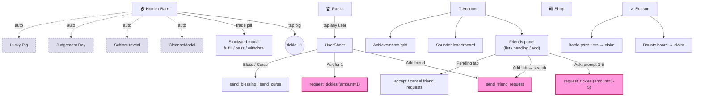

# Interaction Map — How It Works *Now* (build 67)

The current user-interaction flow for Tickle the Pig, before the
Season-1 social redesign. This is the "as-is" — a baseline to grill
against, not a target.

> **The common way to draw this** is a *user-flow / interaction-flow
> diagram*. The standard text format is **Mermaid** (`flowchart`) —
> it renders in GitHub, VS Code, Notion, etc. The Mermaid block is
> below; an ASCII version follows for quick reading.

---

## Mermaid — current interaction flow



Pink nodes = **the same action reachable two ways, inconsistently.**
Dashed = **auto-fires with no user tap.**

---

## ASCII — the five tabs at a glance

```
 HOME 🏠        RANKS 🏆       SEASON ⚔       SHOP 🛍       ACCOUNT 👤
 ─────         ─────          ──────         ─────         ───────
 tap pig       tap a user     bounty board   wardrobe      your code (copy)
 = tickle      → UserSheet:   → claim        → equip       achievements →
               • add friend   tier list      buy catalog   Sounder →
 trade pill      • ask for 1    → claim        titles        FRIENDS panel:
 → Stockyard     • bless          ▲              ▲           • list → "Ask"
   (fulfill)     • curse          │              │           • pending
                  ▲               │              │           • add → search
 [auto pop-ups]   │               │              │           Pro / paywall
 cleanse,         │               │              │
 schism,      ────┘  the ONLY  ───┘              │
 judgement,         place to                     │
 lucky,             bless/curse                   │
 release notes,     is buried 3
 tier-up            taps deep
```

---

## Why it feels confusing — the findings

1. **No social home.** Friends live in *Account*. Trades surface on
   *Home* (the pill). Bless/curse only exist inside *UserSheet*,
   reached via *Ranks*. Bounties are in *Season*. A player who wants
   to "do social stuff" has **no single place to go.**

2. **Requesting tickles has two doors, and they disagree.**
   - *UserSheet* → "Ask for 1" — hard-coded to **1**.
   - *Account → Friends → Ask* — a prompt for **1-5**.
   Same RPC, two UIs, different limits.

3. **Adding a friend has two doors** — *UserSheet* "Add friend" and
   *Account → Friends → Add*. Not wrong, but undocumented overlap.

4. **Bless/Curse is buried.** The whole Season-1 ritual system is
   reachable only by: Ranks → tap a user → UserSheet → toggle a
   sub-mode → tap. Three-plus taps, zero discoverability from Home.

5. **Seven things auto-pop.** Cleanse, Schism, Judgement, Lucky Pig,
   Lucky Title, Release Notes, Tier-Up all fire with no tap. On a
   busy launch they can stack.

6. **No in-app notification surface.** Friend requests show only in
   the *Friends → Pending* sub-tab; trade requests show only as the
   *Home* pill badge; everything else is native push or a 2.4s
   toast. There is **no themed inbox** — which is what you mean by
   "notifications should be in the pig theme."

7. **"Applause" does not exist.** Grep found no clap/applause/cheer
   mechanic — only celebration *animations* (Lucky burst, tier-up
   banner, buy FX). If you remember clicking an "applause," it was
   likely one of those, or the trade pill. Worth pinning down.

---

## The shape of the problem

Social + Season-1 is **spread across four of the five tabs** with
**two inconsistent entry points** for the two commonest actions
(ask, add) and **no inbox**. The redesign question is essentially:
*where does "social" live, and what's the one consistent way in?*
