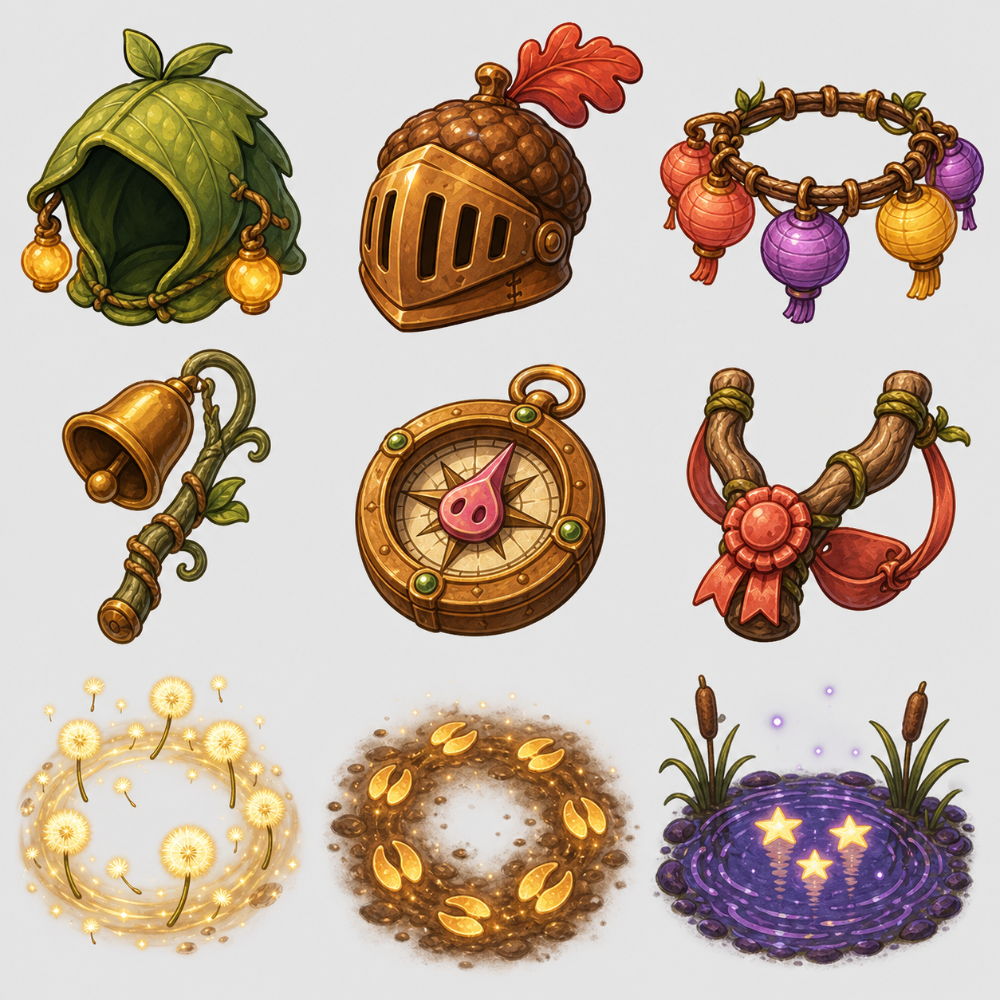

# Nine equipment candidates



These nine items were designed as a bridge between the physical card game and
Tickle the Pig's cosmetic catalog. Each has a stable snake-case ID, wearable
category, rarity, suggested shop cost, description, card rank/style, Play
effect, and Training effect in [`new-game-items.mjs`](./new-game-items.mjs).

They are intentionally **not live catalog rows yet**. Each candidate still
needs:

1. an isolated transparent equipment asset derived from the approved concept;
2. a Rosie placement/animation pass at production scale;
3. a card illustration using the same silhouette and materials;
4. a migration assigning its final acquisition source and price; and
5. explicit approval before any database push.

Validate the content contract with:

```sh
node scripts/validate-new-trading-card-items.mjs
```

The concept sheet was generated with the built-in image generator using the
approved Release Party Crown rendering as a quality/material reference. It does
not copy the Crown or its card frame.

