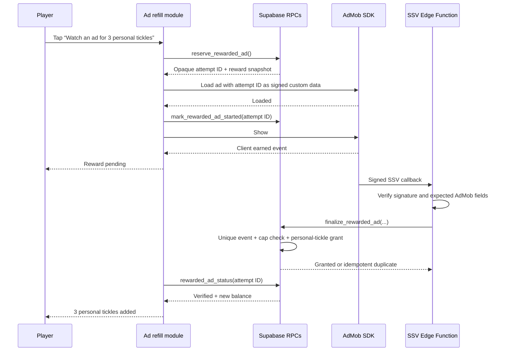

# Rewarded ads implementation plan

**Status:** implemented locally and feature-dark — no remote database, Edge Function, dashboard, or store changes have been made  
**Platform:** direct Google AdMob, iOS-first  
**Related research:** [Rewarded ads platform research](research/rewarded-ads-platforms.md)

## Recommended pilot contract

Build the system with a server-configurable limit of **1–5 completed rewards per rolling 24 hours**, but launch with these values:

- one completed ad reward per rolling 24 hours;
- three **personal tickles** per completed ad;
- offer shown only when the total home-tickle balance is zero;
- personal tickles are consumed by home taps before ordinary tickles and cannot fund tickle trades or gifts;
- direct AdMob rewarded ads only—no banners, interstitials, app-open ads, or mediation;
- iOS and declared-age-eligible accounts only;
- non-personalized ad requests for the first experiment, with no ATT prompt;
- global feature flag off by default, with per-user tester overrides.

The data model permits raising the daily limit to five without rebuilding the app. Increasing the limit is a later product decision based on measured economy and retention effects, not part of the initial launch.

## Deep module and seams

The player-facing module should expose one small interface to the Barn:

```tsx
<AdRefillOffer
  homeBalance={stats.itemCount}
  onBalanceChanged={fetchStats}
/>
```

The module returns `null` unless the feature is enabled, the bank is empty, the account is eligible, and the server has an available reward slot. It owns the offer, declared-age check, consent flow, reservation, ad loading, display, pending-verification state, and recoverable errors. The Barn must not know AdMob event names, ad-unit identifiers, consent states, or SSV details.

Inside the module, define two private ports:

- `RewardedAdProvider`: AdMob production adapter plus a fake adapter for tests.
- `RewardedAdBackend`: Supabase production adapter plus a fake adapter for tests.

These are real seams because each has both production and test adapters. Do not add a public multi-network abstraction or MAX/LevelPlay adapters during the pilot.

Suggested location:

```text
features/rewarded-ads/
  AdRefillOffer.tsx          # the external interface and player-facing states
  rewardedAdFlow.ts         # orchestration and state transitions
  admobAdapter.ts            # provider adapter
  supabaseAdapter.ts         # status/reserve/start/cancel/poll adapter
  types.ts                   # private port and result types
```

## Authoritative flow



The client earned event never mints tickles. It only changes the presentation to `Reward pending` while the signed server callback completes.

## Database migration

Create timestamped migrations after `20260801010000_sounder_invite_security_grants.sql`. They are authored and tested locally first; they are not pushed without the founder's explicit **go**.

### Storage

1. Add `sponsor_tickle_count integer NOT NULL DEFAULT 0 CHECK (sponsor_tickle_count >= 0)` to `user_items`.
2. Add minimal declared-age fields to `profiles`, such as nullable `ads_age_eligible boolean DEFAULT NULL` and `ads_age_confirmed_at timestamptz`. `NULL` means unknown and is ineligible. Do not collect date of birth.
3. Add private `rewarded_ad_settings` with one `ad_refill` row:
   - `enabled`—backend kill switch;
   - `reward_amount`—initially 3, constrained to a safe range;
   - `rolling_limit`—initially 1, constrained to 1–5;
   - `updated_at`.
4. Add private `rewarded_ad_attempts`:
   - opaque UUID primary key;
   - `user_id`, placement, provider, reward snapshot;
   - `reserved`, `started`, `client_abandoned`, `verified`, or `rejected` status;
   - reservation/start/expiry/verification timestamps;
   - unique provider transaction ID once verified.
5. Add an immutable `rewarded_ad_grants` ledger with unique `(provider, provider_transaction_id)`, attempt ID, user ID, amount, and grant time. Store validated identifiers only, not the raw callback URL or ad payload.
6. Add a private `rewarded_ad_consumptions` ledger written once per sponsored home tap. This makes the leaderboard receipt count consumed ad tickles rather than merely granted/unspent ones.
7. Add a private `rewarded_ad_reports` table keyed to a caller-owned attempt, with an allow-listed reason and the provider response identifier needed to investigate the creative. Do not accept free-form report text into the game database; route optional detail through the existing support channel.

All tables have RLS enabled and no direct client policies. Revoke table and sequence access from `PUBLIC`, `anon`, and `authenticated`.

### RPC interface

- `rewarded_ad_offer_status()` — authenticated, read-only status: feature enabled, age eligible, empty-bank eligibility, reward amount, remaining slots, and next eligible time.
- `confirm_rewarded_ad_age_eligibility(p_is_13_or_older boolean)` — records the user's declaration; it must not initialize an SDK by itself.
- `reserve_rewarded_ad()` — locks the caller's profile row, settles ordinary regen, requires a zero total home balance, counts verified grants plus live reservations in the rolling window, and returns an opaque attempt.
- `mark_rewarded_ad_started(p_attempt_id uuid, p_provider_response_id text DEFAULT NULL)` — caller-owned attempt only; extends the finalization window immediately before display and stores a bounded provider response identifier for later creative reporting.
- `cancel_rewarded_ad_attempt(p_attempt_id uuid)` — releases a reservation after no-fill, load failure, or an early close without an earned event.
- `rewarded_ad_attempt_status(p_attempt_id uuid)` — caller-owned polling result; never exposes provider identifiers.
- `report_rewarded_ad(p_attempt_id uuid, p_reason text)` — caller-owned, allow-listed report submission for inappropriate, misleading, or age-inappropriate ads.
- `finalize_rewarded_ad(...)` — callable only by `service_role`; locks the attempt/user, validates the reward snapshot and rolling cap, inserts the unique grant, increments `sponsor_tickle_count`, and marks the attempt verified in one transaction.

Every `SECURITY DEFINER` function gets a fixed `search_path`, explicit revokes, narrow grants, caller ownership checks, and bounded inputs.

### Existing economy changes

- Update `home_stats()` to return `balance = ordinary balance + sponsor_tickle_count` and a separate `sponsor_balance` field for honest UI/reconciliation.
- Add `update_home_tickle()` as a narrow wrapper around `update_profile_and_item_count()`: it consumes one sponsor tickle first when available, temporarily supplies the core function's ordinary input, and lets the existing function run every snout/season XP/happiness/Lucky Pig side effect exactly once. A sponsored tap also inserts one consumption-ledger row in the same transaction. This avoids copying the game's core tickle engine.
- Keep `tickle_info()` and `fulfill_tickle_trade()` based on ordinary `item_count` only. This is what prevents an ad-earned reward from funding a friend's request.
- Add a new `ads` lane to `tickle_breakdown()` or another equally explicit receipt source before launch so competitive totals remain auditable.

## SSV Edge Function

Add `supabase/functions/admob-reward-callback/` with a small request handler and a pure verification module.

The handler must:

1. accept only `GET` callbacks and reject oversized/malformed queries;
2. preserve the original query ordering and encoding when verifying the ECDSA signature;
3. fetch Google's rotating public keys, cache them within the isolate, and select the supplied key ID;
4. verify the signature before trusting custom data or any reward field;
5. require the expected ad-unit ID, reward item, reward amount, timestamp bounds, and opaque attempt ID;
6. call `finalize_rewarded_ad()` with the service-role client;
7. acknowledge verified duplicate callbacks with HTTP 200;
8. return retryable 5xx only for transient internal failures, not permanent invalid callbacks;
9. avoid logging raw signed URLs, user identifiers, or full callback payloads.

Required secrets/configuration include the expected iOS ad-unit ID and reward-item name. `SUPABASE_URL` and `SUPABASE_SERVICE_ROLE_KEY` remain server-only.

## Native and consent work

1. Install `react-native-google-mobile-ads` at the Expo-52-compatible version selected during implementation.
2. Add its Expo config plugin and iOS AdMob app ID. Use Google's rewarded test ID in development and fail closed if a production build lacks the production unit ID.
3. Add the safe-default-false `rewarded_ads` key to the existing server feature-flag interface and seed it off globally. Configure the maximum ad-content rating appropriate for the app and mark requests with the correct declared-age treatment.
4. Before any ad SDK initialization:
   - require server-confirmed feature and declared-age eligibility;
   - run Google UMP's consent update/form flow where required;
   - initialize Mobile Ads only when ads may be requested.
5. Make non-personalized requests for the pilot. Do not request ATT in this phase.
6. Because the package is native, rebuild the development client; Expo Go cannot exercise the feature.

## Barn experience

- Show a quiet **Ad refill** offer only when the total home bank is zero.
- Use literal disclosure: **Watch an ad for 3 personal tickles**.
- Explain once: **For Rosie only—these can't answer trades.**
- Require a second explicit `Watch ad` tap before loading/showing the ad.
- Never auto-open the sheet, pulse the offer, send a reminder, create a streak, or imply that watching supports the business.
- Preserve the normal next-regen countdown beside the offer and make `Not now` equally available.
- After an impression, retain the provider response identifier against the attempt so the player can report that specific ad without exposing the identifier in normal UI.
- States: checking, ready, loading, showing, reward pending, verified, no fill, closed early, offline, and daily limit reached. Failures never consume a completed-reward slot.
- If SSV is delayed, keep a durable pending attempt and reconcile on Barn focus/app foreground instead of telling the user the reward was lost.

## Analytics and experiment

Extend the existing closed, privacy-light analytics vocabulary with Barn-only events:

- `rewarded_ad_offer_opened`;
- `rewarded_ad_started`;
- `rewarded_ad_finished`, using existing result tokens;
- authoritative verified grants come from `rewarded_ad_grants`, not a client event.

Use an experiment/variant token for the one-ad, three-tickle pilot. Do not send ad creative, advertiser, device ID, raw provider response, or free-form error text through interaction analytics.

Evaluate:

- offer → start → client completion → verified-grant conversion;
- no-fill, load failure, delayed-SSV, and duplicate-callback rates;
- ad-generated tickles as a share of home tickles and season-board movement;
- trade confusion caused by personal versus ordinary balances;
- session frequency, next-day/seven-day retention, Slop Club conversion, complaints, and ad reports;
- AdMob's authoritative impressions, revenue, and eCPM.

Do not raise the cap above one until there are at least two weeks of pilot data, no integrity defects, and an explicit economy review.

## Tests and gates

### Automated

- SQL harness tests for eligibility, zero-bank enforcement, rolling limits, reservation races, multi-device attempts, expiry/cancellation, service-role-only finalization, duplicate SSV events, wrong reward/ad-unit data, and sponsor-first consumption.
- Regression tests proving sponsor tickles cannot satisfy `fulfill_tickle_trade()`.
- Migration privilege/RLS contract tests.
- Pure state-machine tests against fake provider/backend adapters: success, no-fill, early close, earned-before-close, close-before-earned, delayed verification, offline recovery, and double tap.
- SSV verification fixtures for valid signature, tampering, unknown key, duplicate transaction, reordered/decoded query, and stale timestamp.
- UI tests proving the offer is invisible when flagged off, balance is nonzero, age is unknown/ineligible, or the daily cap is reached.
- Extend the quality harness to run the Edge Function verification tests.

Run `npm run quality:loop` while changing the player-facing Barn and server contracts, then `npm run quality:check` before handoff. Run `npm run quality:check:full` before any release candidate.

### Manual/device

- Google test ad: finish, skip, background, force-close, offline-after-completion, and delayed callback.
- Consent paths for EEA test geography and non-EEA; declared-age unknown/yes/no.
- VoiceOver, reduced motion, small phone, and poor network.
- Verify the exact TestFlight binary with production-mode configuration and AdMob test devices before enabling a real ad unit.
- Verify inappropriate-ad reporting and provider creative controls.

## Store and operational setup

Before enabling real inventory:

- create the AdMob app and rewarded unit, configure reward name/amount and SSV callback URL, UMP message, content rating, test devices, and invalid-traffic protections;
- update App Store and Play copy that currently promises no ads;
- update the public/in-app privacy policy, App Privacy answers, Play Data safety, and Play `contains ads` declaration;
- add the in-app inappropriate-ad reporting path required by Apple;
- document the feature and test account in App Review notes;
- reassess the 4+ rating and the 13+ account declaration with qualified privacy/legal review.

Any distributable build follows `docs/RELEASE_CHECKLIST.md`. Database migration push, Edge Function deployment, AdMob dashboard activation, TestFlight build, and feature-flag rollout are separate production mutations and each stays dark until its applicable approval/gate.

## Implementation sequence

1. **Economy contract and SQL tests** — sponsor balance, settings, attempts/grants, RPCs, trade isolation, home consumption.
2. **SSV verification** — pure verifier fixtures, callback handler, idempotent finalization tests.
3. **Client module with fake adapters** — state machine and Barn interface without a real SDK.
4. **AdMob adapter and consent** — package/plugin, test IDs, UMP, declared-age gating, native development build.
5. **Barn offer and reconciliation** — zero-bank UI, pending/verified states, stats refresh.
6. **Analytics, disclosures, and reporting** — closed events, aggregate query, ad-report route, privacy/store drafts.
7. **Dark launch** — local database/Edge Function verification, tester override, Google test inventory, device QA.
8. **Pilot release** — release checklist, TestFlight QA, production AdMob test-device pass, explicit go/no-go, then a small one-ad cohort.

The global flag and backend setting are the immediate rollback. Turning either off hides the offer and refuses new reservations while allowing already-verified callbacks to settle safely.
