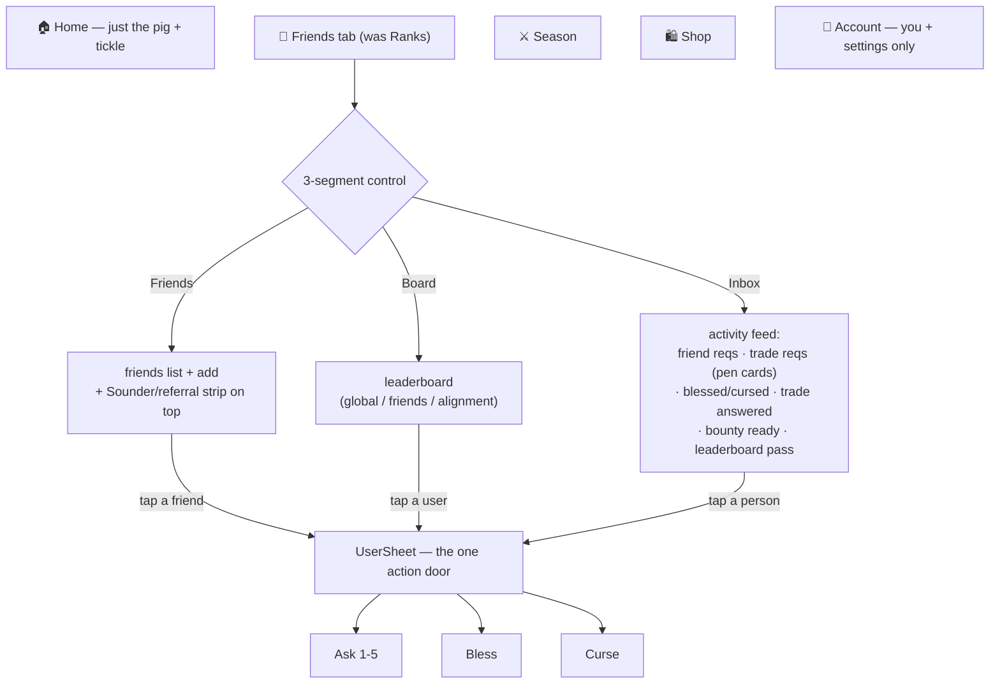

# Season 1 Social Redesign — Spec

The fix for "social is smeared across 4 tabs with no inbox." Derived
from a structured design interview; every decision below is locked.
Companion to `interaction-map-current.md` (the as-is).

---

## Decisions (locked)

| # | Decision |
|---|---|
| 1 | The **Ranks tab is repurposed into the social hub** ("Friends" tab — name tweakable). It holds friends, the inbox, and the leaderboard. |
| 2 | Inside it: a **3-segment control — Friends · Inbox · Board**. |
| 3 | **The Sounder (referral) folds into the top of the Friends segment** — referral stats + invite. "Sounder" keeps meaning *referral*; it is not the tab name. |
| 4 | **Inbox = a full activity feed** — actionable rows (inline buttons, sorted top) + passive event rows. Segment carries an unread-actionable count badge. |
| 5 | **Stockyard modal + Home trade pill retired.** Incoming trades become Inbox rows styled as Stockyard pen cards (the 1920s theme survives as the trade-row look). Home goes back to just the pig. |
| 6 | **UserSheet = the single per-friend action surface.** Tap a friend anywhere → UserSheet → Ask (1-5 picker) / Bless / Curse + alignment & stats. The Friends-list "Ask" prompt and the hard-coded "Ask for 1" are deleted. |
| 7 | **Bless/curse effects get wired** — the Barn honors `my_active_effects()`. Plus obvious casting feedback, receiver notification, and surfaced cooldown. |
| 8 | **Referral revived** via Universal Link + a referral-code field at signup — a later phase, not the first build. |

---

## Target structure

### The Friends tab

- **Friends segment** — a "your Sounder" strip at the top (referral
  count, rank, invite/copy-code), then the friends list. Tapping a
  friend opens UserSheet. Add-friend lives here (search).
- **Inbox segment** — the activity feed (below). The badge counts
  unread *actionable* items only.
- **Board segment** — the existing leaderboard, its three scopes
  (global / friends / alignment) as a sub-control.

### The Inbox feed

One scrolling feed, newest-relevant first, two row types:

- **Actionable** (sorted to top, inline buttons):
  - Incoming friend request → Accept / Decline
  - Incoming trade request → **Give / Pass**, rendered as a Stockyard
    pen card (fence rail, brass button, chalk lot tag)
- **Passive** (tappable info rows):
  - "🍵 briguy blessed you — warm tea" / "👹 someone cursed you"
  - "your trade was answered — +8 tickles"
  - "a bounty's ready to claim"
  - "alice passed you on the board"
- An **"out to market" strip** pinned at the top lists your own
  pending outgoing trade requests (withdrawable).

### Retired

- `TickleTradeModal` (the Stockyard modal) — its theme moves to the
  Inbox trade rows.
- The Home trade pill — the tab-bar badge on the Friends tab replaces it.
- Friends panel leaves the Account tab; Account becomes you + settings.

---

## Bless & Curse — wired

Today the daily ritual records an effect and the Barn **ignores it**
(`my_active_effects()` has zero readers). This redesign makes it real.

### Wire the effects into the Barn loop

The Barn polls `my_active_effects()` and honors:

| Effect | Source | Behavior |
|---|---|---|
| regen multiplier ↑ | `warm_tea` | tickle bank regenerates faster while active |
| regen multiplier ↓ | `sluggish_snout` | regenerates slower (capped 2h/day) |
| next-Lucky boost | `sun_beam` | next Lucky Pig window guaranteed/boosted |
| half-taps | `phantom_itch` | next 3 taps count reduced |
| glow overlay | `halo_kiss` | a visible glow on the pig |
| miasma overlay | `goblin_whisper` | a visible green murk on the pig |
| instant snouts | `bountiful_snouts` / `coin_pinch` | already wired — leave |

### Three interaction requirements

1. **Casting feedback** — blessing/cursing from UserSheet plays an
   obvious cast animation + confirmation, not a silent RPC.
2. **Receiver notification** — the target gets told who + what, as
   **both** a push notification *and* a passive Inbox row. Now that
   effects are wired, the copy is honest ("warm tea — 2× regen, 1h").
3. **Cooldown surfaced** — UserSheet shows the caster's remaining
   daily casts ("2 of 3 left", "already blessed alice today"); the
   receiver's Inbox row / Barn overlay shows when an effect lifts.

---

## Build phases

- **Phase A — the shell.** Repurpose Ranks → Friends tab; 3-segment
  control; move `Friends.tsx` in; leaderboard becomes the Board
  segment; remove Friends from Account.
- **Phase B — the Inbox.** The activity feed; incoming friend +
  trade requests as rows; retire `TickleTradeModal` + the Home pill;
  passive event rows; the "out to market" strip.
- **Phase C — one action door.** UserSheet gets a 1-5 Ask picker;
  delete the duplicate Ask prompt + hard-coded "Ask for 1".
- **Phase D — bless/curse wired.** Barn honors `my_active_effects()`;
  casting animation; receiver push + Inbox row; cooldown UI.
- **Phase E — referral revival** *(follow-up, own branch).* Universal
  Links (AASA + entitlement), `/join` landing page, signup
  referral-code field, `attribute_referral` re-wired.

---

## Open / deferred (recommendations, not blockers)

- **Tab name** — recommend **"Friends"**; "Social"/"Pen"/"Drove" are
  alternatives. Trivial to change.
- **Auto-popping modals** — keep Schism, Judgement, Lucky, Tier-Up,
  Release-Notes as-is (they're moments/info). **CleanseModal stops
  auto-popping** — a curse instead surfaces as an Inbox row; cleanse
  is an action on that row.
- **Push copy** — native push UI can't be pig-themed (it's iOS's),
  but the *copy* should be in the app's voice. The Inbox is the
  fully themed surface.
- **"Applause"** — no such mechanic exists; if a clap/cheer
  interaction is wanted it's net-new, deferred.
