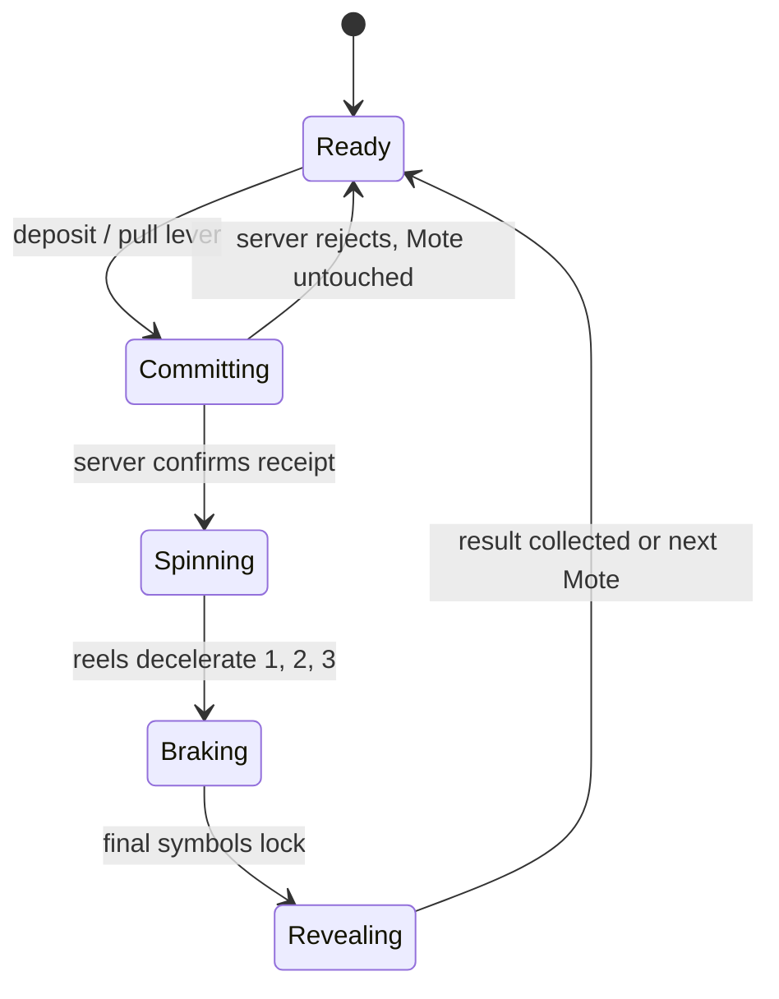

# Full-page Mote Machine and Contraption Inventory

- Status: implementation specification
- Rewritten: 2026-08-29
- Replaces: the Mote Alchemy and bonus-Tickles specifications

## Product definition

The Mote Machine is an earned surprise ritual, presented with slot-machine
theater but without gambling economics. A player brings one Mote found in a
Shimmer Pocket, deposits it into the machine, wakes the cabinet, pulls the
lever, watches three vertical reels spin and brake, and always receives useful
fuel for a named Contraption.

There are no recipes, odds controls, purchasable plays, cash-out language, or
empty outcomes. The server selects and grants the result before Rive reveals
it. Rive can make the outcome exciting; it can never choose or award it.

## First playable reward

The first reward family is the **Auto-Tickler** and its distinct fuel,
**Clockwork Acorns**.

- The first Clockwork Acorn permanently unlocks the Auto-Tickler.
- Repeat results add 1, 2, 3, or 5 Acorns to its inventory stack.
- One Acorn starts one day of service.
- Five Acorns start one week of service.
- Activating while already active extends the existing end time.
- Every Mote returns at least one Acorn.

The catalog and receipt model support future Contraptions with their own fuel.
Blessing and curse helpers remain catalog extensions until their targeting,
consent, and stopping policies are explicitly specified.

## Auto-Tickler service rule

While active, the Auto-Tickler periodically settles the player's regenerated
Tickle bank and spends only the amount above `personal cap - 5`. At cap 25 it
stops at 20; at cap 50 it stops at 45. It resumes as regeneration raises the
balance above that dynamic reserve.

Each automatic tickle:

- increases `profiles.tickles_earned` by one;
- increases the normal spendable Snout counter by one;
- appears in an auditable service-event receipt;
- does not advance personal Streak, happiness, Lucky Pig, or visit systems.

A server schedule performs the work while the app is closed. App reads may
also reconcile a player's service so state is fresh when they return.

## Primary interaction

One Rive lever and one integrated machine button may both fire `requestPlay`.
Native code latches synchronously so simultaneous touch and accessibility
actions still create one request. Reel motion begins only after the server has
confirmed the idempotent receipt.

## Rive composition

The shipping baseline is the preserved pre-alchemy reel-machine source at
`artifacts/mote-machine/mote-machine-polish-final-source.riv`. It contains the
lever, three independently clipped vertical reels, staggered stopping motion,
settle, full-page cabinet, and View Model bindings. The alchemy artboard is
retired.

### Required authored hierarchy and motion

- Full-page `MOTE MACHINE` artboard using `Fit.Layout`.
- `MoteMachine` state machine and `MoteMachineViewModel` / `Default` instance.
- Separate `Reel Strip` instances clipped behind three windows.
- Separate `Lever Arm` and `Lever Knob` with direct press feedback.
- `Machine Spin` full-motion timeline and `Machine Settle` reduced-motion path.
- A ready idle with restrained light, no urgency loop, and no near-miss tease.
- A deposit/wake beat, lever pull, fast vertical travel, staggered braking,
  small overshoot, cabinet impact, and final reward hold.

### Runtime View Model

| Authored property | Type | Runtime meaning |
| --- | --- | --- |
| `requestPlay` | trigger | Player asks native code to commit one Mote |
| `spin` | trigger | Native starts the confirmed visual reveal |
| `tickles` | number | Legacy authored numeric reel selector; presentation only, never a Tickle grant |
| `motes` | number | Confirmed Mote balance |
| `reduceMotion` | boolean | Selects the short settle path |
| `busy`, `canPlay`, `hasError` | boolean | Interaction and recovery state |
| `motesLabel` | string | Confirmed balance copy |
| `ticklesLabel` | string | Bound Contraption-fuel result copy despite the legacy property name |
| `actionLabel`, `statusLabel` | string | App-authored machine copy |

The legacy names `tickles` and `ticklesLabel` remain only because they are
embedded in the approved Rive source. No player-facing surface calls the result
Tickles, and the next editor pass should rename them to `resultTier` and
`rewardLabel` without changing authority.

## Motion timing

Full motion targets roughly 4.2 seconds after confirmation:

1. 0–350 ms: Mote seats, cabinet wakes, lights climb.
2. 350–700 ms: lever pulls and springs back.
3. 550–2,500 ms: all three reels travel rapidly.
4. 2,500–3,700 ms: reels brake left-to-right with 180–260 ms stagger.
5. 3,700–4,200 ms: cabinet impact, reward glow, readable hold.

Reduced Motion uses a short lever response, crossfade/scale settle, and result
hold under 500 ms. It does not replay vertical travel or repeated flashes.

## Server contract

`mote_machine_state()` returns the confirmed Mote balance, enabled reward
family, and the caller's Contraption inventory.

`spin_mote_machine(p_request_id text)` atomically:

1. locks the caller's Mote wallet;
2. replays an existing receipt for the same request ID when present;
3. rejects without spending when no Mote exists;
4. selects a positive resource amount;
5. spends exactly one Mote;
6. unlocks/upserts the Contraption and its resource balance;
7. records the result and remaining balance;
8. returns the confirmed reveal payload.

`contraption_inventory()` returns catalog metadata, resource balances, active
service windows, and recent service receipts.

`activate_contraption(id, duration)` consumes the exact helper-specific
resource cost and starts or extends the service atomically.

## Recovery and trust

- Persist the request ID before the network mutation.
- A timeout means “check the last play,” never “refunded” or “try a new roll.”
- Repeating the same request ID returns the same receipt without another debit.
- A Rive load or animation failure cannot change the confirmed result.
- After confirmation, fallback copy names the awarded resource and offers the
  inventory even when motion fails.
- No client path writes inventory balances, active times, or service receipts.

## Contraption Inventory

The inventory is separate from cosmetics, Adventure Bag items, and Ramble
gear. Each card shows the Contraption visual, its own fuel icon/name and count,
service status, exact stopping rule, and available 1-day/1-week activation.
Locked Contraptions are not shown as empty stacks: the first resource win
unlocks the corresponding card immediately.

## Streak surfaces delivered with this loop

- Personal Streak is an explicit number surrounded by fire around the Home
  spendable Tickle-bank counter.
- Auto-Tickler activity never advances it.
- Sharing uses an owner-initiated native share action; visitors do not
  automatically see the current or broken count.
- Visit Streak is a separate shared per-friend flame. Either friend's first
  qualifying visit keeps it alive, and the Friend row shows its explicit count.

## Accessibility and performance

- Native exposes semantic back, play, result, inventory, and activation nodes.
- Announce the exact Contraption, resource amount, Motes remaining, and unlock
  state once per receipt.
- Reel blur, flame color, and glow never carry meaning without text/number.
- Touch targets are at least 44 pt and the action is disabled while committed.
- Keep all three runtime `.riv` copies byte-identical and under 4 MB.
- No frame-sequence, video, GIF, or React Native reel animation fallback.

## Acceptance criteria

- Every confirmed Mote grants a positive, stored Contraption resource.
- First reward unlocks the Auto-Tickler and repeat rewards recharge it.
- One-day and one-week activation deduct the correct Acorn cost.
- Active service spends only above `cap - 5`, awards normal Snouts and
  `tickles_earned`, and leaves personal Streak unchanged.
- Reels spin vertically, slow, stop left-to-right, and reveal the confirmed
  result in Rive; Reduced Motion uses the short path.
- Lost responses replay one receipt without a second Mote or reward.
- Home shows the fiery explicit personal count; Friend rows show shared Visit
  Streaks; either direction of visit credits the same pair once.
- Migration harness, focused Jest tests, Rive verifier, and project quality
  checks pass before enabling the feature flag.

## Non-goals for the first slice

- Purchasable Motes, fuel, spins, freezes, or streak restorations.
- Player-controlled reel-stop buttons that alter rewards. A later purely
  theatrical braking interaction may be explored only if it cannot imply a
  reroll or change the server result.
- Automatic blessing/curse targeting before its consent and policy grill.
- Day-30/day-90 Visit Streak cosmetic assets; the longest-count foundation
  lands now and the matching wearables remain a content follow-up.
