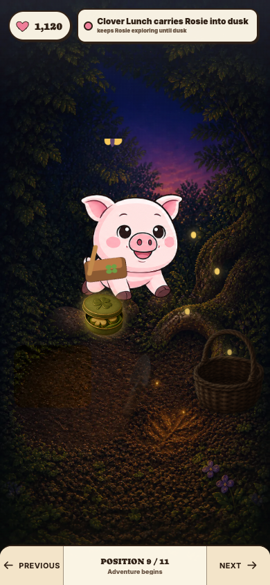
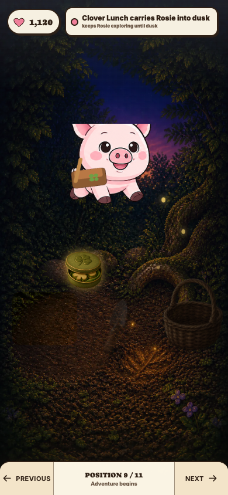
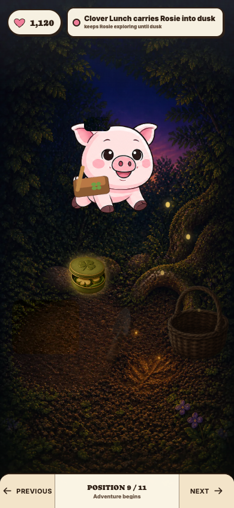
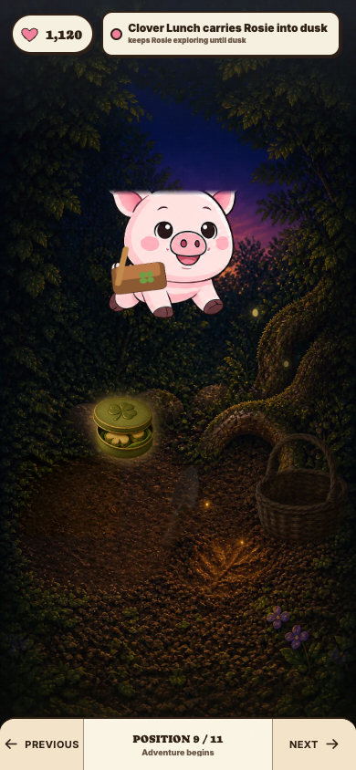
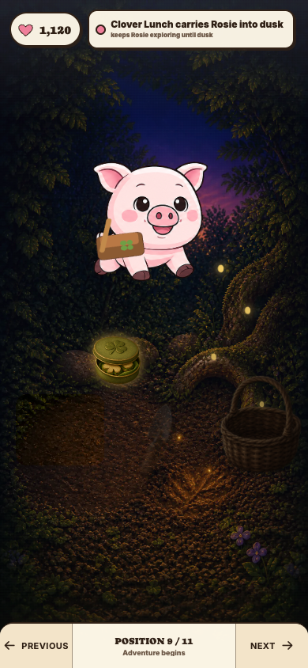
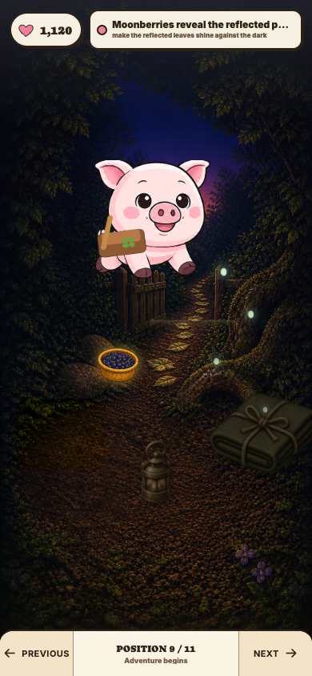

# Position 9 Rive fragment study — v0.142

## Question

How should the unexplained yellow-and-purple fragment at the top of the
Position 9 Rive viewport be removed without clipping canonical Rosie or
weakening her authored Provision hop?

The approved visual anchor is
`assets/concepts/homegrown-adventures/end-to-end-flow/rosie-v3/09-adventure-vignette.png`.
It contains no floating fragment. The game contract requires the complete
Rosie silhouette, fitted satchel, both deterministic Adventure routes, all
Provision / Tool / Carrier causes, and reduced motion to remain intact.

## Reproduction

The baseline fragment appeared at the exact top edge of the bounded Rive
viewport during the Glowroot and Lanternleaf Adventure vignettes. Runtime
isolation showed two sources inside the shared artboard:

- purple wings from the dusk-moth resident, because the first Adventure still
  asked the Home scene to present moths;
- a yellow moth-body ellipse omitted from the authored `Dusk Moths Hidden`
  opacity timeline.

## Rendered treatments

### A — crop the top 15 pixels

Rejected. It removes the fragment but visibly cuts Rosie's ears and head at
the top of her Provision hop.

### B — cover the fragment with a route-matched background patch

Rejected. The patch becomes a visible rectangle and paints over Rosie as her
hop crosses the same area.

### C — fade the top edge with an alpha mask

Rejected. The fade trades the fragment for a visibly dissolved head and ear
silhouette.

## Decision — repair the authored hidden pose

No browser-layer treatment is safe. The selected treatment keeps the existing
viewport and character motion unchanged, suppresses non-Rosie Home residents
while the Adventure clearing is mounted, and corrects the actual Rive source:
frame 0 of `Dusk Moths Hidden` now keys the yellow body ellipse to 0% blend.

The corrected runtime export preserves Rosie's complete hop and clean upper
silhouette on both routes. The throwaway `fragmentStudy=A|B|C` switches and
debug runtime exposure remain prototype evidence only and must not enter the
production checkpoint.
